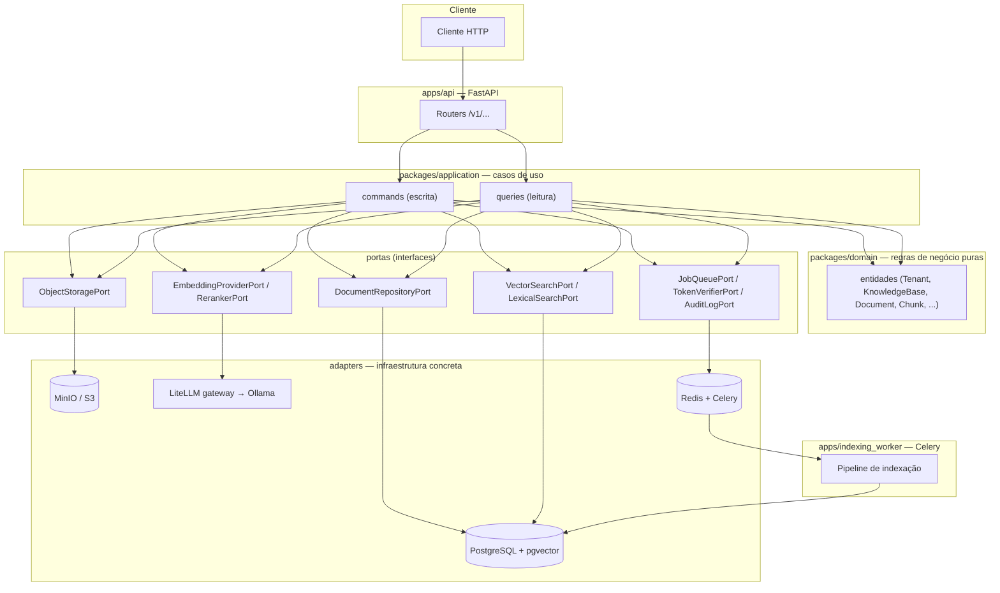

# rag-platform

Plataforma self-service de RAG (Retrieval-Augmented Generation) multi-tenant: ingestão de documentos, recuperação híbrida (vetorial + lexical), geração de respostas fundamentada em citações, avaliação de qualidade, governança e observabilidade de ponta a ponta.

[](https://www.python.org/)
[](https://fastapi.tiangolo.com/)
[](https://docs.pydantic.dev/)
[](https://www.sqlalchemy.org/)
[](https://alembic.sqlalchemy.org/)
[](https://www.postgresql.org/)
[](https://github.com/pgvector/pgvector)
[](https://redis.io/)
[](https://docs.celeryq.dev/)
[](https://min.io/)
[](https://www.litellm.ai/)
[](https://ollama.com/)
[](https://github.com/docling-project/docling)
[](https://opentelemetry.io/)
[](https://prometheus.io/)
[](https://grafana.com/)
[](https://www.docker.com/)
[](.github/workflows)
[](https://docs.astral.sh/ruff/)
[](https://mypy-lang.org/)
[](https://docs.pytest.org/)

## Visão geral

O `rag-platform` deixa qualquer time criar bases de conhecimento, enviar documentos (PDF, Markdown, TXT, DOCX) e consultá-los por linguagem natural, recebendo respostas fundamentadas — sempre com citação da evidência usada, nunca uma afirmação inventada quando não há evidência suficiente. É multi-tenant desde a base: todo dado é isolado por `tenant_id`, e um recurso de outro tenant nunca é distinguível de um recurso inexistente (404, nunca 403).

O projeto está sendo construído de forma incremental a partir de um backlog de atividades (`RAG-XXX`) descrito em [`rag-platform-llm-implementation-plan.md`](rag-platform-llm-implementation-plan.md) — o documento de referência para requisitos, arquitetura-alvo e critérios de aceite de cada atividade. Cada atividade é entregue em uma branch/PR separada, com lint, checagem de tipos, testes com cobertura, migrations e segurança (SAST/SCA/secret scanning) validados antes do merge.

As decisões de design e limitações conhecidas de cada atividade já implementada estão documentadas em [`IMPLEMENTATION.md`](IMPLEMENTATION.md) — este README foca no panorama do projeto: o que é, com quais tecnologias, a arquitetura e a estrutura de diretórios.

## Tecnologias

**API e aplicação**
- **Python 3.12** — linguagem de todo o backend (API, workers, scripts).
- **FastAPI** — API HTTP assíncrona (`/v1/...`), com `TestClient`/`app.openapi()` validados em CI.
- **Pydantic v2** — validação de contratos HTTP, configuração da aplicação (Pydantic Settings) e entidades de domínio (modelos imutáveis, `frozen=True`).
- **SQLAlchemy (async) + Alembic** — ORM e migrations versionadas contra PostgreSQL, via `asyncpg`.

**Dados e mensageria**
- **PostgreSQL 16 + pgvector** — banco relacional único, também usado para busca vetorial (índice HNSW) e busca lexical (Full Text Search nativo, índice GIN) — sem um banco vetorial separado.
- **Redis** — broker e result backend do Celery.
- **Celery** — fila e workers assíncronos (indexação de documentos, e futuramente avaliação).
- **MinIO (S3-compatible)** — armazenamento dos arquivos originais enviados, via `aioboto3`.

**IA e recuperação**
- **LiteLLM** — gateway único para embeddings, reranking e geração, por trás de aliases versionados (`config/models/`) — trocar o modelo real por trás de um alias é configuração do gateway, não do código.
- **Ollama** — serve o modelo de embeddings self-hospedado (Qwen3-Embedding-0.6B) via `llama.cpp`, sem depender de um provedor pago.
- **Docling** — extração de texto e metadados de documentos (Markdown, TXT e DOCX hoje; PDF é uma limitação temporária, ver `IMPLEMENTATION.md`).
- Fusão **RRF (Reciprocal Rank Fusion)** dos rankings vetorial + lexical, e reranking por cross-encoder configurável.

**Observabilidade e segurança**
- **OpenTelemetry** — tracing distribuído (API + worker) e métricas técnicas/de negócio, sem captura de conteúdo sensível.
- **Prometheus + Grafana** — coleta e dashboards das métricas exportadas.
- **JWT (PyJWT)** — autenticação e resolução de tenant; modo local simulado explicitamente não-produtivo.
- **gitleaks, bandit, pip-audit, hadolint** — secret scanning, SAST, SCA e lint de Dockerfile no CI, com governança de exceções (`security/exceptions.yml`).

**Qualidade e entrega**
- **Ruff, Mypy, Pytest (+ cobertura)** — lint, checagem de tipos e testes; gate mínimo de cobertura em 85%.
- **Docker + Docker Compose** — ambiente local completo (Postgres, Redis, MinIO, Ollama, LiteLLM, OTel Collector, Prometheus, Grafana) e imagens de produção da API/worker.
- **GitHub Actions** — CI em toda PR (lint, typecheck, testes, migrations, segurança) e publicação de imagens no GHCR a cada push em `master`.

## Arquitetura

Arquitetura hexagonal (portas e adaptadores): o domínio e os casos de uso (`packages/domain`, `packages/application`) não importam nenhum framework de infraestrutura — nem SQLAlchemy, nem um cliente HTTP, nem um SDK de nuvem. Toda dependência externa é uma **porta** (uma interface Python) com um ou mais **adapters** concretos, trocáveis sem tocar o domínio (por exemplo, `KnowledgeBaseRepositoryPort` tem um adapter em memória para testes e um adapter Postgres para produção).



**Fluxo de ingestão** (upload → indexação): o cliente envia um documento (`POST /v1/knowledge-bases/{id}/documents`), que é validado, armazenado no object storage e enfileirado como `IndexJob`. Um worker Celery consome o job, extrai o conteúdo (Docling), normaliza e divide em chunks determinísticos, gera embeddings em lote (LiteLLM/Ollama) e persiste tudo numa única transação que ativa a nova versão do documento — sem nunca deixar uma versão parcialmente indexada visível.

**Fluxo de consulta** (retrieval → geração, em construção): a pergunta é embedada e buscada em paralelo por similaridade vetorial e por full-text search; os dois rankings são combinados por RRF e reordenados por um reranker configurável; as evidências resultantes alimentam a construção de contexto (dentro de um orçamento de tokens) e a geração de resposta fundamentada, sempre citando a evidência usada — sem evidência suficiente, a resposta é a recusa explícita, nunca uma invenção.

**Isolamento multi-tenant**: toda consulta ao banco recebe `tenant_id` explicitamente (nunca um filtro implícito ou global); a identidade e o tenant são resolvidos a partir de um JWT verificado em cada requisição; um recurso de outro tenant é sempre 404, nunca 403 — para não vazar nem a existência do recurso.

**Erros e observabilidade**: toda resposta de erro segue [Problem Details](https://www.rfc-editor.org/rfc/rfc7807) (RFC 7807), nunca uma stack trace; toda requisição, upload, indexação e (futuramente) consulta é rastreada via OpenTelemetry e instrumentada com métricas Prometheus, sem capturar conteúdo sensível em nenhuma das duas.

## Estrutura do projeto

```text
rag-platform/
├── apps/                      # pontos de entrada dos processos
│   ├── api/                   # FastAPI: routers, dependencies, main.py
│   ├── indexing_worker/       # worker Celery de indexação
│   └── evaluation_worker/     # worker de avaliação (E6, em construção)
├── packages/                  # domínio e lógica de aplicação (sem infra)
│   ├── domain/                # entidades, enums, exceções — regras puras
│   ├── application/           # casos de uso (commands/queries) + portas
│   ├── contracts/              # schemas Pydantic dos endpoints HTTP
│   ├── config/                # Settings (Pydantic Settings) e aliases de modelo
│   ├── generation/             # prompt versionado, context builder
│   ├── retrieval/              # fusão RRF
│   ├── ingestion/               # normalização e chunking
│   ├── evaluation/             # schema do dataset dourado
│   └── observability/          # tracing e métricas (OpenTelemetry)
├── adapters/                   # implementações concretas de cada porta
│   # postgres/, object_storage/, queue/, docling/, litellm/, reranker/,
│   # vector_search/, lexical_search/, token_verifier/, audit_log/,
│   # document_repository/, document_processor/,
│   # knowledge_base_repository/, evaluation/
├── migrations/                 # Alembic (schema versionado)
├── config/                     # YAML versionado: prompts/, models/, retrieval/
├── datasets/golden/             # dataset dourado de avaliação
├── deploy/                     # compose/ e observability/ (dashboards Grafana)
├── scripts/                     # utilitários (ex.: mintar token JWT local)
├── security/                    # exceções de segurança (`exceptions.yml`)
├── tests/                       # unit/, integration/, contract/, e2e/, evaluation/
├── .github/workflows/            # CI (PR) e segurança
├── docker-compose.yml            # ambiente local completo
├── Dockerfile.api / Dockerfile.worker
├── README.md                     # este arquivo
├── IMPLEMENTATION.md              # decisões de implementação por atividade
└── rag-platform-llm-implementation-plan.md   # backlog e requisitos de referência
```

## Como rodar localmente

Pré-requisito: Python 3.12 e Docker.

```bash
cp .env.example .env        # ajuste credenciais/portas se quiser
docker compose up -d        # Postgres+pgvector, Redis, MinIO, Ollama, LiteLLM, OTel, Prometheus, Grafana
docker compose ps           # aguarde todos ficarem "healthy"

make install                # cria .venv e instala dependências de desenvolvimento
.venv/bin/alembic upgrade head   # aplica as migrations

make run-api                # sobe a API em http://localhost:8000
```

```bash
curl http://localhost:8000/health/live
curl -i http://localhost:8000/health/ready   # 200 se Postgres/Redis/MinIO OK, 503 com detalhe caso contrário
```

Comandos de qualidade (rodam sobre `apps/`, `packages/`, `adapters/`, `tests/`):

```bash
make lint       # ruff check + ruff format --check
make typecheck  # mypy
make test       # pytest com relatório de cobertura (gate mínimo: 85%,
                # elevado a partir de RAG-004, quando o primeiro código
                # de aplicação real passou a existir)
make check      # lint + typecheck + test — o pipeline local completo
```

Para mintar um token JWT de desenvolvimento (modo local simulado, ver `IMPLEMENTATION.md`):

```bash
python scripts/mint_local_dev_token.py --subject dev-user --tenant-id 11111111-1111-1111-1111-111111111111
```

## Documentação adicional

- [`IMPLEMENTATION.md`](IMPLEMENTATION.md) — decisões de design, limitações conhecidas e testes de cada atividade já implementada.
- [`rag-platform-llm-implementation-plan.md`](rag-platform-llm-implementation-plan.md) — backlog, requisitos funcionais/não funcionais e critérios de aceite de referência.

O prompt é estruturado em campos, não um texto livre único, para que os
requisitos de aceite sejam verificáveis independentemente:

- `system_template`: instrução geral (responder só com base no
  contexto fornecido).
- `untrusted_context_notice`: declara que o conteúdo recuperado é dado,
  não instrução — qualquer comando embutido nos documentos deve ser
  ignorado (requisito de segurança da seção 13: conteúdo recuperado
  nunca deve ser tratado como instrução).
- `citation_instruction`: exige citação do `chunk_id` para toda
  afirmação relevante.
- `no_evidence_response`: resposta fixa para quando não há evidência
  suficiente (seção 12.1) — nunca inventar uma resposta.

`PromptTemplate` (Pydantic, `frozen=True`) valida que nenhum desses
campos é vazio e que `id`/`version` internos do YAML batem com o nome
do arquivo. `render(context, question)` só concatena essas partes —
seleção/priorização de evidência por orçamento de tokens (RAG-041) e a
chamada ao modelo (RAG-042) são responsabilidade de atividades
seguintes.

Testes: `tests/unit/test_prompts.py` cobre carregamento do `answer.v1`
real, os três requisitos de aceite acima, erro (`PromptNotFoundError`)
para id/versão inexistente, erro de inconsistência id/versão-vs-nome-de-arquivo,
cache por `(id, version)` e imutabilidade.

## Extração de conteúdo (RAG-023)

Implementa o passo 8 do fluxo de indexação (seção 11 do plano):
extrair texto e metadados de um documento já em memória (baixado do
object storage por quem chama — esta atividade não decide isso,
fica para o pipeline orquestrador do RAG-024/RAG-027 usar). Normalização,
chunking, embeddings e persistência (passos 9-14) continuam sem
implementação — RAG-024 a RAG-027.

`packages/application/ports/document_parser.py` define
`DocumentParserPort` (`parse(filename, content, content_type) ->
ParsedDocument`) — o domínio e os casos de uso não importam Docling
diretamente, só esta porta. `ParsedDocument` carrega o texto extraído
já normalizado para Markdown, a contagem de páginas (`None` quando o
formato não pagina, como Markdown/texto puro/DOCX) e o mimetype
original. Erros são categorizados em duas classes, ambas com
`content_type`/`detail` seguros para o chamador expor:
`UnsupportedDocumentFormatError` (formato que este parser não processa
— nunca, ou ainda não) e `DocumentParsingError` (formato suportado, mas
o conteúdo em si não pôde ser extraído — corrompido, malformado etc.).

`adapters/docling/parser.py` (`DoclingDocumentParser`) é a única
implementação hoje, para os quatro tipos aceitos no upload (RAG-021):
Markdown e texto puro (Docling trata texto puro como markdown trivial)
e DOCX extraem com sucesso; **PDF levanta `UnsupportedDocumentFormatError`
por enquanto** — não é uma decisão definitiva de excluir PDF, é uma
limitação temporária explicada em detalhe na docstring do módulo:

- O pipeline padrão de PDF do Docling baixa pesos de modelo em runtime
  — um modelo de detecção de **layout** do Hugging Face Hub sempre, e
  um modelo de **OCR** (RapidOCR) do ModelScope quando `do_ocr=True`.
  Isso foi testado nesta atividade: desabilitar OCR evita só o segundo
  download, não o primeiro — o modelo de layout não é OCR, é a
  extração de estrutura em si (o plano, seção 4.2, só exclui "OCR
  avançado" do escopo do POC).
- Nem o ambiente de dev local nem o ambiente onde isso foi pesquisado
  têm egress liberado para `huggingface.co`/`modelscope.cn` hoje.
- Por isso a dependência instalada é só
  `docling-slim[convert-core,format-markdown,format-docx,format-pdf]`
  (~450MB) em vez do extra `standard`/`all` (~5,5GB, que traz
  `torch`/`transformers`/`docling-ibm-models` para os modelos de ML). O
  extra `format-pdf` é necessário mesmo sem processar PDF porque
  `docling.document_converter` importa o backend de PDF
  incondicionalmente no nível de módulo — mas o `DocumentConverter`
  deste adapter nunca registra `InputFormat.PDF`, então nenhum modelo é
  carregado nem baixado.
- **Caminho para habilitar PDF depois** (não é trabalho desta
  atividade): pré-baixar os pesos uma vez com egress liberado
  (`docling-tools models download`), apontar
  `PdfPipelineOptions(artifacts_path=..., do_ocr=False)` para esse
  diretório (elimina o download em runtime), adicionar o extra
  `models-local` à dependência e decidir onde os pesos pré-baixados
  vivem em cada ambiente — essa última parte é uma decisão de deploy
  (RAG-07x), não de código.

Testes: `tests/unit/test_docling_parser.py` cobre os quatro formatos
do RAG-021 (Markdown, texto puro e DOCX extraindo com sucesso; PDF
levantando `UnsupportedDocumentFormatError`, sem tentar decodificar o
conteúdo), um `content_type` desconhecido e um DOCX corrompido
(`DocumentParsingError`, não `UnsupportedDocumentFormatError` —
distinção que o critério de aceite "erro de parsing é categorizado"
exige).

## Normalização e chunking (RAG-024)

Implementa os passos 9-10 do fluxo de indexação (seção 11 do plano):
normalizar o texto extraído (RAG-023) sem perder estrutura semântica e
dividi-lo em chunks determinísticos, seguindo os defaults da seção
11.1 (tamanho 500 tokens, sobreposição 75, mínimo 50). Embeddings e
persistência (passos 11-14) continuam sem implementação — RAG-025 a
RAG-027.

`packages/ingestion/chunking.py::chunk_document(markdown, *, title,
origin, config=None)` é a função pura: recebe o Markdown de UM
documento e devolve uma lista de `ChunkDraft` (um chunk ainda sem
`id`/`tenant_id`/`knowledge_base_id`/`version_id`/`embedding` — esses
campos só existem quando RAG-026 persiste o `Chunk` de domínio a
partir de um `ChunkDraft`). A assinatura só aceita um documento por
chamada — "não mistura documentos" é garantido estruturalmente, não
por convenção.

- **Seções e parágrafos**: o texto é dividido em blocos por título
  Markdown e por parágrafo; blocos da mesma seção são empacotados
  gulosamente até `chunk_size` tokens. Um chunk nunca combina blocos de
  seções diferentes — cada chunk tem exatamente uma seção de origem
  (`ChunkDraft.section`), o que preserva "seção" sem ambiguidade. Um
  parágrafo isolado maior que `chunk_size` é dividido por tokens
  diretamente (o fallback do passo 10), com sobreposição entre os
  pedaços. Um chunk normal pode terminar um pouco acima de
  `chunk_size` para acomodar um parágrafo inteiro — só o fallback por
  tokens respeita o limite à risca, porque não há mais parágrafo para
  preservar nesse caso.
- **Mínimo**: se o último chunk de uma seção fica abaixo de
  `min_chunk_size`, é fundido no chunk anterior da mesma seção (nunca
  cruza seção, nunca descarta conteúdo). A fusão remove a sobreposição
  já duplicada no início do chunk fundido antes de concatenar — sem
  isso, o trecho de sobreposição apareceria duas vezes.
- **Página**: nenhum formato suportado hoje pelo RAG-023 (Markdown,
  texto puro, DOCX) tem noção de página no Docling — `ChunkDraft.page`
  é sempre `None` na prática atual. O campo existe e é propagado de
  ponta a ponta para quando a extração de PDF paginada existir.
- **Configurável por base**: `ChunkingConfig.from_knowledge_base_config(kb.config)`
  lê `chunk_size`/`chunk_overlap`/`min_chunk_size` de `KnowledgeBase.config`
  (RAG-010), com os defaults da seção 11.1 para o que faltar —
  `InvalidChunkingConfigError` rejeita combinações inconsistentes
  (`chunk_overlap >= chunk_size`, `min_chunk_size > chunk_size`, etc.).
- **Contagem de tokens**: não usamos um tokenizer real (`tiktoken`) —
  ele baixa o vocabulário BPE em runtime na primeira chamada
  (`openaipublic.blob.core.windows.net`), o mesmo problema de egress já
  documentado para o modelo de layout do Docling (RAG-023).
  `_count_tokens` aproxima com uma contagem de palavras/pontuação via
  regex — determinística, sem download. É uma aproximação aceitável
  para chunking (o que importa é um tamanho consistente), mas vale
  reavaliar antes de reusar esse número para orçamento de contexto de
  geração (RAG-041) ou limites de lote de embeddings (RAG-025).

Testes: `tests/unit/test_chunking.py` cobre os critérios de aceite —
documento vazio, seções nunca misturadas, página sempre `None` hoje,
determinismo, validação de `ChunkingConfig`, `from_knowledge_base_config`,
o fallback por tokens (com verificação de sobreposição exata entre
pedaços consecutivos) e a fusão por mínimo sem duplicar a sobreposição
(inclusive com `chunk_overlap=0`).

## Embeddings via LiteLLM (RAG-025)

Implementa o passo 11 do fluxo de indexação (seção 11 do plano):
"gerar embeddings em lotes". Persistência e ativação de versão (passos
12-14) continuam sem implementação — RAG-026/027.

`packages/application/ports/embedding_provider.py` define
`EmbeddingProviderPort` (`embed(texts) -> list[list[float]]`, uma
embedding por texto, preservando a ordem) — domínio e casos de uso não
importam LiteLLM nem `httpx` diretamente. Erros são categorizados:
`EmbeddingTimeoutError` (timeout em todas as tentativas) e
`EmbeddingProviderUnavailableError` (qualquer outro erro do gateway —
HTTP >= 500, erro de conexão, corpo malformado, contagem de embeddings
divergente da de textos enviados — depois de esgotar as tentativas).

`adapters/litellm/embedding_provider.py` (`LiteLLMEmbeddingProvider`)
fala com o gateway LiteLLM (seção 5 do plano: "AI Gateway: LiteLLM")
por HTTP simples (`POST {base_url}/embeddings`, API compatível com
OpenAI que o LiteLLM expõe em modo proxy) usando `httpx` — não a SDK
Python `litellm`, que rotearia para provedores diretamente e
duplicaria o papel do gateway, reintroduzindo o tipo de dependência
pesada já evitada em RAG-023/024. Timeout por tentativa e retry com
backoff exponencial são configuráveis (`Settings.litellm_timeout_seconds`,
`litellm_max_retries`); um HTTP 4xx nunca é retentado (não é
transitório). Lotes de até `litellm_embedding_batch_size` textos por
requisição (default 100); a resposta é reordenada pelo campo `index`
de cada item, nunca assumindo que o gateway devolve na ordem enviada.

**O que ficou de fora desta atividade, propositalmente**: nenhum proxy
LiteLLM real foi provisionado nesta atividade (`docker-compose.yml` não
ganhou um serviço novo) — isso exigiria escolher e configurar
credenciais de um provedor de embeddings de verdade, o que não existia
em lugar nenhum do `.env.example` até então. Era uma decisão de produto
(qual provedor, que modelo) que ficou para o usuário decidir
explicitamente, não algo para assumir sozinho. `Settings.litellm_base_url`
já apontava para onde o gateway deveria estar (`http://localhost:4000`,
a porta padrão do proxy LiteLLM) para quando isso fosse provisionado —
o que aconteceu no RAG-030 (ver seção abaixo), quando essa decisão foi
tomada.

**Alias versionado**: `config/models/embedding.v1.yaml` (carregado por
`packages/config/models.py::get_default_embedding_model()`, mesma
convenção de `packages/generation/prompts.py`/RAG-040) declara o alias
que a aplicação usa — trocar o modelo por trás do alias é configuração
do gateway LiteLLM, não deste repositório; uma mudança que precise de
um alias novo cria `embedding.v2.yaml`, nunca edita o existente.

Testes: `tests/unit/test_litellm_embedding_provider.py` cobre os
critérios de aceite — lista vazia não chama o gateway, alias e textos
corretos são enviados, resposta fora de ordem é corrigida, batching
com preservação de ordem, retry com sucesso na tentativa seguinte,
esgotamento de retries por timeout/erro de servidor/erro de conexão,
erro de cliente (4xx) sem retry, corpo malformado, contagem
divergente, e header de autorização quando `LITELLM_API_KEY` está
configurado — tudo via `httpx.MockTransport`, sem chamar um serviço
real. `tests/unit/test_model_config.py` cobre o carregador de alias
(mesmos critérios de `test_prompts.py`).

## Persistência de chunks e ativação de versão (RAG-026)

Implementa os passos 8-14 do fluxo de indexação (seção 11 do plano):
extração, chunking, embeddings, persistência e ativação de versão,
tudo orquestrado por um único adapter real de `DocumentProcessorPort`
(RAG-022) — antes disso, `NotImplementedDocumentProcessor` fazia todo
`IndexJob` reivindicado falhar definitivamente de propósito.

`adapters/document_processor/pipeline.py` (`PipelineDocumentProcessor`)
não faz nenhuma extração/chunking/embeddings por conta própria: só
resolve `IndexJob` -> `Document` -> `DocumentVersion` mais recente ->
`KnowledgeBase`, chama o `DocumentParserPort` (RAG-023), a função pura
`chunk_document` (RAG-024, não é um port), o `EmbeddingProviderPort`
(RAG-025) e, por fim, persiste tudo via os métodos novos de
`DocumentRepositoryPort` desta atividade.

**Métodos novos em `DocumentRepositoryPort`** (todos sem filtro de
tenant — o worker resolve um `Document`/`KnowledgeBase` a partir de um
`document_id`/`index_job_id` isolado, antes de ter qualquer tenant
autenticado em mãos; mesma justificativa já usada por
`claim_index_job` no RAG-022):
- `get_index_job`, `get_document`, `get_latest_version`: leituras
  simples que o pipeline precisa para montar seu contexto.
- `mark_document_processing`: transiciona `Document.status` para
  `PROCESSING`, idempotente via guarda a nível de SQL
  (`WHERE status != PROCESSING`) — `Document.transition_to` rejeitaria
  `PROCESSING -> PROCESSING` como um self-loop não listado na máquina
  de estados (`packages/domain/entities/document.py`), e um
  reprocessamento (retry de job, ou reindexação futura do RAG-027)
  não pode falhar só por já estar em `PROCESSING`.
- `persist_chunks_and_activate_version`: substitui todos os chunks de
  uma `version_id` pelos novos, grava `extracted_object_key` e ativa a
  versão (`Document.active_version_id`, `status=INDEXED`) — tudo numa
  única transação/commit. Índice parcial nunca fica ativo (se qualquer
  passo do pipeline falhar antes deste método, nada muda no banco, e a
  versão ativa anterior — se houver — continua sendo a consultável).
  A estratégia é DELETE + INSERT (nunca diff): reprocessar a mesma
  `version_id` nunca duplica chunks, só substitui o conjunto inteiro.

Em `KnowledgeBaseRepositoryPort`, `get_by_id_unscoped` é a mesma
exceção deliberada, aplicada à base de conhecimento: o worker só
conhece `Document.knowledge_base_id`, nunca um tenant autenticado, e
precisa do `tenant_id`/`config` da base para montar os chunks e a
config de chunking. Nunca é exposto a um tenant diretamente — todo
caminho autenticado continua usando `get_by_id`.

**O que fica de fora desta atividade, deliberadamente**: se todas as
tentativas de um `IndexJob` se esgotarem (falha definitiva,
`packages/application/commands/index_job.py::process_index_job_attempt`,
já implementado e mesclado no RAG-022), o `Document` correspondente NÃO
é transicionado para `FAILED` — ele fica preso em `PROCESSING` (ou
`PENDING`, se a falha ocorrer antes do passo 2 do pipeline). Fechar essa
lacuna exigiria alterar `process_index_job_attempt` para propagar
`document_id` até o ponto onde a falha definitiva é decidida (hoje só
`index_job_id` está em escopo ali) — uma mudança em código já revisado
e mesclado antes desta atividade, feita sem o autor disponível para
revisar. Ficou registrado aqui como um follow-up conhecido em vez de
mudado silenciosamente; `IndexJob.status=FAILED` já é visível o
suficiente para um operador humano perceber e investigar o documento
travado enquanto isso não é resolvido.

Testes: `tests/unit/test_document_repository_in_memory.py` (classe
`TestRag026PersistChunksAndActivateVersion`) cobre os 5 métodos novos
de `DocumentRepositoryPort` contra o fake em memória — idempotência de
`mark_document_processing`, ativação atômica de versão, e
reprocessamento sem duplicar chunks.
`tests/unit/test_knowledge_base_in_memory_repository.py` cobre
`get_by_id_unscoped` (incluindo bases já excluídas — o método nunca
filtra por status). `tests/unit/test_pipeline_document_processor.py`
cobre a orquestração completa do `PipelineDocumentProcessor` com fakes
para as 5 portas: pipeline de ponta a ponta com sucesso, reprocessamento
idempotente, e os três casos defensivos (job sumido, documento sem
versão, base de conhecimento ausente).

## Status de indexação e reindexação (RAG-027)

Implementa o objetivo do épico E2 restante: expor o status de um job
de indexação ao cliente e permitir disparar uma nova indexação sem
subir um arquivo de novo.

`GET /v1/jobs/{index_job_id}` (prometido desde o RAG-021, ver o
docstring de `DocumentUploadResponse`) devolve estado e erros de um
`IndexJob`: `status`, `attempts`, `error_code`, `error_message`. Como
`IndexJob` não carrega `tenant_id` (só `document_id`), o isolamento é
transitivo — `packages/application/queries/document.py::
get_index_job_status` resolve `IndexJob` -> `Document` ->
`KnowledgeBase` (via `get_by_id_unscoped`, RAG-026) e só então compara
`KnowledgeBase.tenant_id` contra o tenant autenticado; um job de outro
tenant (ou inexistente) é sempre 404, nunca 403 (mesmo padrão do resto
da API).

`POST /v1/knowledge-bases/{id}/documents/{document_id}/reindex`
(`packages/application/commands/document.py::reindex_document`) dispara
uma reindexação: cria uma nova `DocumentVersion` (mesma `object_key` da
versão anterior — o conteúdo original nunca muda, só o processamento;
número de versão incrementado) + um novo `IndexJob` (tipo `REINDEX`,
já existente desde o RAG-010) e publica na fila, reaproveitando o novo
método `DocumentRepositoryPort.create_reindex_job` (RAG-027). Só é
permitida quando o documento está `INDEXED` — caso contrário, 409
(`Documento precisa estar indexado para poder ser reindexado`).

**"Consultas continuam disponíveis" (critério de aceite)**: disparar
uma reindexação não toca no `Document.status` nem em `active_version_id`
— eles só mudam quando o worker de fato processa o novo job e chama
`persist_chunks_and_activate_version` (RAG-026). Entre o disparo e essa
ativação, o cliente continua recebendo a versão ativa anterior em
qualquer consulta (retrieval, RAG-030+) — nunca um estado parcial da
reindexação em andamento.

Testes: `tests/unit/test_document_reindex_command.py` cobre os
critérios de aceite do comando (nova versão, reindexação só permitida
em `INDEXED`, documento/base de outro tenant nunca distinguível de
inexistente, e o mapeamento de `DocumentVersionConflictError` — corrida
rara entre duas reindexações do mesmo documento — para 409).
`tests/unit/test_document_status_query.py` cobre a consulta de status
e seu isolamento por tenant. `tests/unit/test_jobs_router.py` e as
novas funções em `tests/unit/test_document_router.py` cobrem a visão
HTTP dos dois endpoints (200/202/401/404/409).

## Busca lexical (RAG-031)

Implementa a recuperação de chunks por PostgreSQL Full Text Search —
o objetivo do épico E3 que não dependia de nenhuma decisão de produto
pendente (ao contrário do RAG-030, busca vetorial: na época, continuava
bloqueada porque o modelo/alias real de embeddings, e portanto sua
dimensão, ainda não tinha sido escolhido por trás do gateway LiteLLM —
decisão deliberadamente adiada no RAG-025 — e um índice ANN pgvector
exige dimensão fixa. RAG-031 não tinha essa dependência, por isso foi
implementada primeiro; RAG-030 resolveu essa decisão depois — ver seção
abaixo).

Migration 0004 adiciona `chunks.content_tsv`, uma coluna GERADA pelo
Postgres (`GENERATED ALWAYS AS (to_tsvector('simple', content)) STORED`,
suportado desde o PostgreSQL 12) com um índice GIN — a aplicação nunca
escreve nela, o Postgres recalcula sozinho sempre que `content` muda.
Configuração `simple` (não `portuguese` nem outro idioma específico):
o conteúdo de um chunk pode estar em qualquer idioma que o tenant
carregar, e a plataforma não pergunta o idioma em nenhum lugar do
fluxo de upload — `simple` é um denominador comum seguro, sem
stemming específico de idioma; trocar para uma configuração dedicada
por base de conhecimento é uma decisão futura, não deste RAG.

`packages/application/ports/lexical_search.py` define `LexicalSearchPort`
(`search(tenant_id, knowledge_base_id, query, limit) -> list[ScoredChunk]`)
e `adapters/lexical_search/postgres.py` (`PostgresLexicalSearch`) a
implementa via `ts_rank` + o operador `@@` contra `content_tsv`,
compilado pelo SQLAlchemy para exatamente a forma que o planner do
Postgres casa com o índice GIN. Três critérios de aceite, todos no
próprio `WHERE`/`ORDER BY` da consulta, nunca em Python depois:
- **Filtros antes do ranking**: `chunks.tenant_id`/`chunks.knowledge_base_id`
  (já denormalizados na tabela, RAG-011) entram no `WHERE`.
- **Só a versão ativa**: um `JOIN` com `documents` em
  `documents.active_version_id == chunks.version_id` exclui chunks de
  qualquer versão superada por uma reindexação (RAG-026/027) — mesmo
  que ainda existam fisicamente na tabela (`persist_chunks_and_
  activate_version` não apaga chunks de versões antigas ao ativar uma
  nova, um efeito colateral de armazenamento conhecido e aceito, não
  uma falha de isolamento).
- **Ranking determinístico**: `ORDER BY ts_rank(...) DESC, chunks.id ASC`
  — o `id` como desempate estável, já que `ts_rank` sozinho não separa
  scores empatados.

`adapters/lexical_search/in_memory.py` (`InMemoryLexicalSearch`) é um
fake para testar só o contrato da porta (filtros de tenant/base,
ordenação determinística, `limit`) sem Postgres — não modela versões
nem "versão ativa" (`Chunk` não carrega `document_id`), e usa uma
contagem de termos simples em vez de `ts_rank`; quem monta um cenário
de teste com ele só deve indexar chunks que já representem uma versão
ativa, mesmo cuidado que qualquer teste com `InMemoryDocumentRepository`.

Testes: `tests/unit/test_lexical_search_in_memory.py` cobre o contrato
da porta (filtro por tenant, por base, ranking por número de termos,
desempate determinístico, `limit`, query sem termos relevantes).
`tests/unit/test_schema.py::test_chunks_content_tsv_has_a_gin_index`
verifica a coluna gerada e o índice GIN a partir de `Base.metadata`
(mesma abordagem sem banco real do RAG-011) — "índice GIN utilizado"
de fato (via `EXPLAIN` contra um Postgres real) fica para
`tests/integration/`, quando essa suíte existir, mesma limitação já
documentada para os demais adapters Postgres deste projeto.


## Auditoria de ações administrativas (RAG-054)

Registra um evento de auditoria (ator, tenant, ação, tipo/id de
recurso, timestamp) para cada ação administrativa que já existe hoje
na API: criar/atualizar/excluir base de conhecimento (RAG-012) e
enviar/reindexar documento (RAG-021/RAG-027). Escopo desta atividade:
"registrar", não "consultar" — um endpoint de leitura do trilho de
auditoria (para um painel administrativo, por exemplo) fica para uma
atividade futura, então `packages/application/ports/audit_log.py`
(`AuditLogPort`) só tem `record`.

Append-only por design, não por convenção: nem a porta nem nenhum
adapter (`adapters/audit_log/`) declara um método de atualização ou
remoção. `migrations/versions/0005_create_audit_events.py` cria
`audit_events` — `resource_id` não é uma foreign key (é polimórfico:
aponta para `knowledge_bases.id` OU `documents.id`, dependendo de
`resource_type`, e uma FK exigiria uma única tabela de destino);
`tenant_id` é FK normal para `tenants.id`, com o mesmo índice que
todas as outras tabelas multi-tenant deste schema (RAG-011). Não é
uma entidade de domínio (mesmo precedente de
`document_idempotency_keys`, RAG-021): infraestrutura de aplicação,
então só existe em `adapters/postgres/models/audit_event.py`, nunca
em `packages/domain/entities`.

Uma falha ao registrar um evento (ex.: banco indisponível) nunca deve
derrubar a ação administrativa que já teve sucesso — isso trocaria
uma falha de observabilidade por uma indisponibilidade real da API.
`record_audit_event_safely` (mesmo módulo da porta) é o que os
routers chamam em vez de `audit_log.record(...)` direto: registra a
falha via `logging` (nunca engole em silêncio) e sempre retorna
normalmente. `actor` vem de `TokenClaims.subject` (RAG-050/RAG-051,
`Depends(get_current_identity)`, já injetado nos endpoints
existentes ao lado de `Depends(get_current_tenant_id)` — mesma
identidade, sem verificar o token duas vezes).

`adapters/audit_log/in_memory.py` (`InMemoryAuditLog`) expõe
`events: list[AuditEvent]` — não faz parte da porta, é só para os
testes inspecionarem o que foi registrado (mesmo padrão de
`InMemoryLexicalSearch.index_chunk`, RAG-031).

Testes: `tests/unit/test_audit_log.py` cobre o contrato da porta e
`record_audit_event_safely` (inclusive que uma falha de gravação
nunca propaga); `tests/unit/test_schema.py` cobre o formato da tabela
(colunas obrigatórias, `resource_id` sem FK); e cada router de teste
(`test_knowledge_base_router.py`, `test_document_router.py`) tem uma
classe `TestAuditLog` provando que a ação HTTP correspondente
registrou exatamente um evento com o ator/tenant/ação/recurso
esperados.
## Tracing distribuído (RAG-052)

Instrumenta a API e o worker de indexação com OpenTelemetry, cobrindo
o fluxo upload -> indexação de ponta a ponta (a API publica o
`IndexJob` no Celery, o worker consome) e, automaticamente, qualquer
fluxo futuro (ex.: `/v1/query`, RAG-044): a instrumentação é aplicada
uma vez, no nível da app FastAPI e da app Celery compartilhada, nunca
por rota ou por task — nada precisa mudar quando novos endpoints ou
tasks forem adicionados.

`packages/observability/tracing.py` concentra toda a configuração.
Decisão deliberada: ela lê variáveis `OTEL_*` diretamente
(`os.getenv`), não via `packages.config.settings.Settings` — a
primeira, porque `configure_tracing()` roda dentro de
`create_app()` (`apps/api/main.py`), e esse módulo nunca chama
`get_settings()` (vários testes importam a app sem nenhuma variável
de ambiente de negócio configurada, incluindo um teste que existe
justamente para provar que a liveness independe de configuração); a
segunda, porque `OTEL_EXPORTER_OTLP_*` já seguem a especificação
padrão do OpenTelemetry, e o próprio `OTLPSpanExporter()` já as lê
sozinho — reimplementar isso via `Settings` só duplicaria lógica do
SDK. `OTEL_TRACES_ENABLED` (não é uma variável do OpenTelemetry) é o
único interruptor nosso: default `false` — sem ele, a instrumentação
continua ativa, mas contra o tracer no-op padrão do OpenTelemetry
(nenhum `TracerProvider` real): zero overhead, zero thread em
background, zero chamada de rede, o que é o que mantém os testes
unitários passando sem nenhum Collector real no ar (seção 1 do
plano). `docker-compose.yml`/`.env.example` já ligam essa variável
para desenvolvimento local — como o `run-api`/`run-worker` do
Makefile rodam no host (RAG-003), essas variáveis só chegam ao
processo se estiverem no ambiente real do shell, não só em `.env`
(Pydantic Settings lê `.env` diretamente; um `os.getenv` puro não);
por isso os dois alvos agora fazem `set -a; . ./.env; set +a` antes
de subir o processo.

Três instrumentações, cada uma sem captura de conteúdo sensível:
- **FastAPI** (`instrument_fastapi_app`): só método HTTP, rota e
  status code — nunca corpo da requisição/resposta.
- **SQLAlchemy** (`instrument_sqlalchemy_engine`, chamado em
  `adapters/postgres/engine.py:get_engine`, uma vez por instância de
  engine — não globalmente, porque testes recriam o engine cacheado
  via `get_engine.cache_clear()`): `db.statement` é o SQL
  parametrizado (bind parameters), nunca o valor literal.
- **Celery** (`CeleryInstrumentor`, instrumentado tanto no processo
  da API quanto no do worker — é o que propaga o contexto de trace
  através da mensagem do broker Redis, correlacionando o span do
  upload com o da task de indexação): só nome da task e ID do job —
  nunca `args`/`kwargs`. Nenhuma task atual recebe texto de documento
  como argumento de qualquer forma (`process_index_job_task` só
  recebe um UUID).

Testes (`tests/unit/test_tracing.py`) dublam os três limites com
efeito colateral real (exportador, processor, provider, os dois
instrumentors de terceiros) e verificam só a lógica deste módulo:
liga/desliga por `OTEL_TRACES_ENABLED`, idempotência da instrumentação
do Celery entre chamadas, o override por `OTEL_SERVICE_NAME`, e que
`instrument_fastapi_app`/`instrument_sqlalchemy_engine` delegam para
os instrumentors corretos. Validar exportação de verdade (traces
chegando no Collector, correlacionados entre API e worker) fica para
verificação manual via `docker compose up` — nenhum teste de pull
request sobe infraestrutura real (seção 1 do plano).

## Busca vetorial e provisionamento do gateway de embeddings (RAG-030)

Destrava a decisão de produto deixada propositalmente em aberto no
RAG-025/RAG-011 (ver seções acima): qual modelo de embeddings vive por
trás do alias `embedding-model-alias`, e portanto qual dimensão fixar
em `chunks.embedding` para poder criar um índice ANN. Decisão tomada:
**Qwen3-Embedding-0.6B**, self-hospedado via **Ollama**, dimensão
nativa **1.024** — abordagem open source, sem depender de um provedor
pago de embeddings.

**Por que Ollama, e não Text Embeddings Inference (TEI)**: TEI é a
opção "padrão" da Hugging Face para servir modelos de embedding, mas
tem um histórico documentado de falhas rodando o Qwen3-Embedding-0.6B
especificamente em CPU (crash por falta de export ONNX do modelo e
erros de Intel MKL — `huggingface/text-embeddings-inference#667`).
Ollama usa `llama.cpp` (formato GGUF) como motor de inferência, maduro
e primariamente desenhado para CPU, evitando essa classe de problema.

**Migration 0006** corrige `chunks.embedding` (criada sem dimensão em
0002 — RAG-011) para `vector(1024)` via `ALTER COLUMN ... USING
embedding::vector(1024)`, e cria o índice **HNSW** (`vector_cosine_ops`)
— HNSW em vez de ivfflat porque não exige um passo de treino com dados
já existentes (a tabela está vazia neste ponto) e é a recomendação
atual do próprio pgvector para a maioria dos casos.

`packages/application/ports/vector_search.py` define `VectorSearchPort`
(`search(tenant_id, knowledge_base_id, query_embedding, limit) ->
list[ScoredChunk]`) — reusa `ScoredChunk` de `lexical_search.py`
(RAG-031), já pensado desde então para os dois tipos de busca.
`adapters/vector_search/postgres.py` (`PostgresVectorSearch`) implementa
via `ChunkModel.embedding.cosine_distance(...)`, compilado pelo
SQLAlchemy para o operador `<=>` que o planner do Postgres casa com o
índice HNSW. Mesmos três critérios de aceite de RAG-031, pelo mesmo
padrão (filtros no `WHERE`, join até `documents.active_version_id`
para só a versão ativa, `ORDER BY` com `chunks.id` como desempate
determinístico) — com um filtro adicional, `embedding IS NOT NULL`
(um chunk cuja indexação ainda não gerou embedding nunca aparece num
resultado). O score devolvido é similaridade de cosseno (`1 -
distância`), não a distância bruta, para manter a mesma convenção
"maior é melhor" da busca lexical — RAG-032 (fusão RRF) é quem vai
combinar os dois rankings.

`adapters/vector_search/in_memory.py` (`InMemoryVectorSearch`) é um
fake para testar só o contrato da porta, mesmo papel do fake lexical —
calcula similaridade de cosseno em Python puro (sem numpy).

**Infraestrutura local** (`docker-compose.yml`): dois serviços novos.
`ollama` serve o modelo (porta `11434`); `ollama-pull-embedding-model`
roda uma vez, baixa `qwen3-embedding:0.6b` (~640MB) no volume
`ollama_data` e termina — subidas seguintes reaproveitam o modelo já
local. `litellm` (o proxy real, finalmente provisionado — RAG-025)
usa `config/litellm/config.yaml` para mapear o alias
`embedding-model-alias` para `ollama/qwen3-embedding:0.6b`; só sobe
depois que o pull termina com sucesso. Trocar de modelo no futuro é
editar esse `config.yaml` (e rodar `ollama pull` do novo modelo) —
nunca `config/models/embedding.v1.yaml`, cujo alias é estável (seção 8
do plano); uma mudança que exija um alias novo (dimensão diferente)
cria `embedding.v2.yaml`.

Testes: `tests/unit/test_vector_search_in_memory.py` cobre o contrato
da porta (ranking por similaridade, desempate determinístico, filtro
por tenant/base, `limit`, chunk sem embedding é ignorado,
`query_embedding` vazio levanta `ValueError`).
`tests/unit/test_schema.py` verifica a partir de `Base.metadata` (sem
banco real, mesma abordagem do RAG-011/031) que `chunks.embedding` tem
dimensão fixa 1.024 e que o índice HNSW existe com o operador
`vector_cosine_ops` correto. "Usa índice pgvector" de fato (via
`EXPLAIN` contra um Postgres real) e a integração ponta a ponta com
Ollama/LiteLLM ficam para verificação manual via `docker compose up` e
para `tests/integration/` quando essa suíte existir — mesma limitação
já documentada para os demais adapters Postgres deste projeto.

## Métricas Prometheus (RAG-053)

Destrava com métricas o mesmo que RAG-052 destravou com traces: técnica
(HTTP, Celery) e de consumo (negócio) — via OpenTelemetry, reaproveitando
a infraestrutura de RAG-003 (Collector expondo `:8889` em formato
Prometheus, já scrapado pelo Prometheus do `docker-compose.yml`).

`packages/observability/metrics.py` segue exatamente a mesma arquitetura
de `tracing.py` (RAG-052) — mesmo racional de ler `OTEL_*` diretamente
via `os.getenv`, mesmo interruptor próprio (`OTEL_METRICS_ENABLED`,
default `false`) para não exportar nada em teste, mesma garantia de
zero overhead quando desligado (a API do OpenTelemetry nunca falha sem
um `MeterProvider` real — devolve um meter "no-op" atrás de um proxy que
é atualizado sozinho se um provider real for definido depois).

**Técnicas**: nenhum código novo — `FastAPIInstrumentor`/`CeleryInstrumentor`
(já aplicados por `configure_tracing`/`instrument_fastapi_app`, RAG-052)
emitem métricas E traces ao mesmo tempo, a partir do que estiver
configurado globalmente no momento em que são chamados; por isso
`configure_metrics()` roda antes de `instrument_fastapi_app(app)` em
`apps/api/main.py` (mesma ordem que já valia para `configure_tracing`).

**De consumo**: `record_document_uploaded`/`record_document_reindexed`/
`record_knowledge_base_mutation`/`record_index_job_attempt`/
`record_embedding_batch` — chamados a partir dos MESMOS pontos de
entrada que já registram auditoria (RAG-054) ou processam o trabalho de
fato (routers da API, a task Celery, o adapter LiteLLM), nunca de
dentro de `packages/application` (domínio e casos de uso não importam
OpenTelemetry diretamente, seção 5.1 do plano — a mesma razão pela qual
RAG-054 registrou auditoria a partir dos routers). A única mudança em
`packages/application`: `process_index_job_attempt` (RAG-022) agora
devolve um `IndexJobAttemptOutcome | None` (antes devolvia sempre
`None`) — o único jeito de a task Celery distinguir sucesso de falha
definitiva sem inspecionar `IndexJob` de novo, já que as duas retornam
normalmente (só a falha NÃO definitiva levanta `RetryableIndexJobError`).

**Cardinalidade** (critério de aceite "labels não possuem cardinalidade
descontrolada"): todo label vem de um conjunto fixo e pequeno —
`mime_type` (4 valores, `_ALLOWED_EXTENSIONS_BY_MIME_TYPE`), `action`
(create/update/delete), `status` (succeeded/failed_retryable/failed_final)
— nunca `tenant_id`, `document_id` nem qualquer outro identificador de
cardinalidade livre.

**Dashboards básicos** (critério de aceite): `deploy/observability/grafana/
dashboards/rag-platform-overview.json`, carregado automaticamente pelo
provider `file` em `provisioning/dashboards/dashboards.yml` — seis
painéis (requisições HTTP por rota, documentos enviados por tipo MIME,
mutações de base de conhecimento por ação, tentativas de indexação por
desfecho, duração de indexação p50/p95, chamadas ao gateway de
embeddings). Os nomes exatos de métrica no Prometheus dependem da
conversão que o exporter do OTel Collector faz (pontos viram
underscores, contadores ganham sufixo `_total`, histogramas viram
`_bucket`/`_sum`/`_count`) — confirmar contra `curl localhost:8889/metrics`
na primeira subida real (`docker compose up`) fica para verificação
manual, mesma limitação já documentada para os demais adapters/infra
deste projeto que dependem de um Postgres/Collector real (nenhum teste
de pull request sobe infraestrutura real, seção 1 do plano).

Testes: `tests/unit/test_metrics.py` cobre `configure_metrics`
(ligado/desligado, override de `OTEL_SERVICE_NAME`) e cada `record_*`
(instrumento e labels corretos), tudo com o exportador/provider/reader
dublados — mesmo padrão de `test_tracing.py`. `test_index_job_processing.py`
cobre o novo valor de retorno de `process_index_job_attempt`.
`test_indexing_worker_task.py` cobre que a task registra o desfecho
certo (incluindo que a métrica de falha retryable é registrada e a
exceção ainda é relançada, para o `autoretry_for` do Celery continuar
funcionando). `test_knowledge_base_router.py`/`test_document_router.py`
cobrem que cada endpoint chama a métrica certa.

## Publicação de imagens no GHCR (RAG-072)

`.github/workflows/publish.yml` constrói e publica as imagens da API e
do worker em `ghcr.io` a cada push em `master` — na prática, a cada PR
mergeada (nunca em PR: publicar uma imagem de um branch de feature não
teria consumidor). Convive com `pull-request.yml`/`security.yml`
(RAG-070/071), que continuam sendo o gate de qualidade/segurança antes
do merge.

**`Dockerfile.api`/`Dockerfile.worker`** (multi-stage): o estágio
`builder` instala só as dependências de produção declaradas em
`pyproject.toml` (nunca os extras de dev — ruff/mypy/pytest/bandit/
pip-audit não têm por que existir na imagem publicada), usando pacotes
Python vazios como placeholder só para o `pip install .` resolver os
metadados do projeto sem precisar do código-fonte real ainda — isso
mantém a camada de instalação de dependências cacheável independente
de mudança de código. O estágio final copia o resultado desse install
mais `apps/`, `packages/`, `adapters/` e `config/` de verdade, roda
como usuário não-root, e usa `python -m uvicorn`/`python -m celery`
(em vez do executável direto) para garantir que o diretório de
trabalho (`/app`, onde `apps/`/`packages/`/`adapters/`/`config/` foram
copiados) entre no `sys.path` — sem isso, `apps.api.main` não seria
importável. **`config/` precisa ficar como irmão de `packages/` no
filesystem da imagem, nunca instalado via pip**: `packages/config/
models.py`/`packages/generation/prompts.py` resolvem o caminho via
`Path(__file__).parent.parent.parent / "config"`, relativo à raiz do
projeto, não a um pacote instalado (mesma razão por que `make install`
usa `pip install -e` em vez de um install normal).

**Critérios de aceite:**

- **"tag por SHA"**: cada imagem é publicada como `ghcr.io/<owner>/
  rag-platform-{api,worker}:sha-<sha completo do commit>` — imutável e
  rastreável a um commit exato. `:latest` também é publicada, como
  conveniência para quem só quer "a mais recente"; RAG-074/075 (deploy)
  devem sempre referenciar a tag `sha-<sha>` (ou o digest), nunca
  `:latest`, que é uma tag móvel.
- **"digest registrado"**: o digest (`sha256:...`) de cada imagem
  publicada é escrito no resumo da run do workflow
  (`GITHUB_STEP_SUMMARY`) — visível a partir da própria run, sem
  precisar reconstruir a imagem para descobrir qual digest foi
  publicado.
- **"SBOM gerada"**: `docker/build-push-action` (`sbom: true`) gera um
  SBOM (SPDX, via BuildKit) e o anexa à imagem publicada como
  attestation OCI — nenhuma ferramenta além do próprio buildx.
  `provenance: true` também é gerado (registro verificável de como/onde
  a imagem foi construída) — não é um critério de aceite explícito,
  mas é o mesmo mecanismo do buildx, sem custo adicional.
- **"nenhuma credencial permanente necessária"**: autenticação no GHCR
  usa o `GITHUB_TOKEN` efêmero da própria Actions run (`permissions:
  packages: write`, expira ao fim do job) — nenhum PAT nem segredo de
  longa duração é criado ou armazenado no repositório.

**Smoke check antes de publicar**: como não há Docker disponível no
ambiente onde esta atividade foi desenvolvida (nenhuma forma de
validar o build localmente antes do PR), o workflow constrói cada
imagem localmente na runner primeiro (`load: true`, sem publicar) e
roda um `python -c "import ..."` do módulo de entrada de cada uma
(`apps.api.main`/`apps.indexing_worker.worker`) dentro do container —
pega um Dockerfile quebrado (dependência faltando, caminho de `config/`
errado) antes de chegar ao registro. O cache do buildx (`type=gha`) faz
o build de publicação reaproveitar as camadas do build de teste, em
vez de reconstruir do zero.

**Validado localmente nesta atividade** (sem Docker disponível, mas
com as mesmas ferramentas que os jobs de CI usam): `hadolint --config
.hadolint.yaml --failure-threshold error` em ambos os Dockerfiles
(limpo — só um aviso `DL3008`, nível `warning`, não bloqueia) e
`actionlint` no workflow novo (limpo). A validação de que os builds
de fato funcionam (o smoke check acima) só acontece na primeira run
real do workflow, após o merge — mesma limitação já documentada para
os demais adapters/infra deste projeto que dependem de um ambiente
real (Postgres, Collector) que este sandbox não tem.
## Reranker (RAG-033)

Reordena os candidatos que já saíram da fusão RRF (RAG-032) por
relevância de verdade em relação à query, via um cross-encoder —
mais caro e mais preciso que o ranking por similaridade/RRF que já
os trouxe até ali. É o último passo de recuperação antes do endpoint
`retrieve` (RAG-034, ainda não implementado) e do context builder
(RAG-041).

**Porta e adapters configuráveis** (critério de aceite "pode ser
desativado"): `packages/application/ports/reranker.py` define
`RerankerPort` — domínio e casos de uso não importam LiteLLM (nem
qualquer cliente HTTP) diretamente, mesma disciplina hexagonal de
todo o projeto (seção 5.1 do plano). "Desativado" é a configuração de
QUAL adapter é injetado, nunca um `if` dentro de um adapter só:
`LiteLLMReranker` (`adapters/reranker/litellm.py`, reranking real via
o gateway LiteLLM) e `PassthroughReranker`
(`adapters/reranker/passthrough.py`, devolve os candidatos na mesma
ordem, truncados a `top_n`) implementam a mesma porta — quem chama
nunca sabe qual dos dois está por trás. A escolha é
`Settings.reranker_enabled` (`RERANKER_ENABLED`, padrão `false`) — cabe
a quem monta o endpoint `retrieve` (RAG-034) escolher o adapter a
partir dela; esta atividade entrega a porta e os dois adapters — o ponto de
injeção é `apps/api/routers/retrieval.py::get_reranker` (RAG-034).

**`LiteLLMReranker`** fala com o mesmo gateway LiteLLM de RAG-025/030
(`POST {base_url}/rerank`), no formato Cohere Rerank v2 que o LiteLLM
segue para qualquer provedor por trás (Cohere, Voyage, ou um reranker
self-hospedado): `{"model": alias, "query": ..., "documents": [...],
"top_n": ...}` → `{"results": [{"index": int, "relevance_score":
float}, ...]}`. Reaproveita as MESMAS configurações de timeout/retry
do gateway de embeddings (`Settings.litellm_*`) — é o mesmo proxy
LiteLLM, só um alias/endpoint diferente; mesma classificação de erro
de `adapters/litellm/embedding_provider.py` (HTTP 4xx nunca é
retentado; HTTP >= 500/erro de conexão/resposta malformada esgotam as
tentativas antes de levantar `RerankerUnavailableError`). O alias
(`config/models/reranker.v1.yaml`, `reranker-model-alias`) segue a
mesma convenção de `embedding.v1.yaml` (RAG-025/030): qual modelo real
fica atrás dele é decisão de configuração do gateway LiteLLM
(`config/litellm/config.yaml`), não deste arquivo. Este ticket não
escolhe nem provisiona esse modelo real — a atividade não pede essa
decisão (ao contrário de RAG-030, cujo critério de aceite exigia
decidir o modelo de embeddings).

**"timeout usa ranking anterior"** (critério de aceite):
`rerank_safely()` (mesmo padrão de `record_audit_event_safely`,
RAG-054) envolve `RerankerPort.rerank(...)` e devolve os candidatos
ORIGINAIS (truncados a `top_n`, na ordem de entrada — o "ranking
anterior" já produzido pela fusão RRF) em qualquer `RerankerError`
(timeout ou qualquer outro erro do gateway), nunca propagando a
exceção. Reranking é uma melhoria de qualidade sobre um ranking que já
é bom o suficiente — nunca deve derrubar uma consulta inteira.

**"registra latência sem registrar texto sensível"** (critério de
aceite): `LiteLLMReranker` mede a duração da chamada e registra via
`packages.observability.metrics.record_reranker_call` (RAG-053, só um
histograma, sem labels) — nunca o texto dos chunks nem a query, que
nunca viram atributo de métrica nem de log.

Testes: `tests/unit/test_reranker.py` cobre `rerank_safely` (sucesso
repassado verbatim; fallback para o ranking anterior em timeout e em
erro de indisponibilidade; truncamento a `top_n` no fallback).
`tests/unit/test_passthrough_reranker.py` cobre `PassthroughReranker`
(ordem preservada, truncamento, lista vazia). `tests/unit/
test_litellm_reranker.py` cobre `LiteLLMReranker` — mesma estrutura de
`test_litellm_embedding_provider.py`, todo o transporte HTTP dublado
via `httpx.MockTransport`: alias/query/documentos enviados
corretamente, reordenação por `relevance_score` decrescente,
truncamento a `top_n`, retry em erro transitório, esgotamento de
tentativas (timeout e indisponibilidade), erro 4xx nunca retentado,
resposta malformada, header `Authorization` quando `LITELLM_API_KEY`
configurado, e a métrica de latência (chamada só quando há
candidatos). `tests/unit/test_model_config.py` cobre o alias
`reranker.v1.yaml`.

## Endpoint retrieve (RAG-034)

Primeiro endpoint HTTP da fase de geração (E4 do plano): expõe busca
vetorial + busca lexical + fusão RRF (RAG-032) + reranking
configurável (RAG-033) como uma única chamada síncrona, `POST
/v1/knowledge-bases/{id}/retrieve`. Sem geração de resposta (isso é
RAG-042/043) e sem persistir `QueryLog`/`QueryEvidence` (RAG-010) —
essa persistência exige um `query_id` que só existe quando uma query
de verdade é registrada, o que fica para RAG-044. Este ticket entrega
só a recuperação, para poder validar a qualidade do retrieval
isoladamente (inclusive pelo dataset dourado de RAG-060) antes de
acoplar geração.

**Fluxo** (`packages/application/queries/retrieval.py::retrieve_evidence`):
busca a base de conhecimento pelo par `(tenant_id, knowledge_base_id)`
— 404 (nunca 403) se não existir ou for de outro tenant, mesmo padrão
de `documents.py`/`knowledge_bases.py` (RAG-012/RAG-051) — embeda a
query (`EmbeddingProviderPort`), dispara busca vetorial e lexical em
paralelo (`asyncio.gather`, cada uma trazendo um pool de até
`CANDIDATE_POOL_SIZE=100` candidatos), funde os dois rankings via
`reciprocal_rank_fusion` (RAG-032) e só então aplica reranking
(`rerank_safely`, RAG-033) sobre o resultado fundido, truncando a
`top_k`.

**Filtros (`page`/`section`) aplicados pós-fusão, em Python** —
decisão de escopo deliberada: em vez de empurrar o filtro para dentro
do SQL de `VectorSearchPort`/`LexicalSearchPort` (o que exigiria
alterar contratos de porta já mesclados em RAG-030/031), o filtro é
aplicado sobre os candidatos já buscados, antes do reranking. Isso é
suficiente para o volume atual e mantém as portas estáveis; se no
futuro um filtro muito seletivo em uma base grande esvaziar demais o
pool de 100 candidatos, vale revisitar e mover o filtro para a
consulta SQL — não é um problema deste ticket.

**Contrato bloqueia filtro arbitrário** (critério de aceite):
`RetrievalFiltersRequest` (`packages/contracts/retrieval.py`) usa
`extra="forbid"` (mesmo padrão de `KnowledgeBaseCreateRequest`) — só
`page`/`section` são aceitos; qualquer outra chave (ex.: `{"author":
...}`) gera 422 automaticamente via validação do Pydantic, sem
precisar de nenhuma lista de bloqueio própria. `top_k` é limitado por
`Field(ge=1, le=MAX_TOP_K)` no contrato E reclampado de novo dentro do
caso de uso (`bounded_top_k = max(1, min(top_k, MAX_TOP_K))`) — mesma
defesa em profundidade de `list_knowledge_bases`, já que
`packages/application` nunca importa `packages/contracts`.

**`rerank_score` é `None` quando o reranker está desativado**
(`RERANKER_ENABLED=false`): o score de fusão RRF nunca é reaproveitado
como se fosse um score de reranking de verdade — são métricas
diferentes, e expor isso errado no contrato enganaria quem consome a
API.

Testes: `tests/unit/test_retrieval_query.py` cobre o caso de uso
(fusão RRF entre vetorial+lexical, deduplicação de um chunk presente
nos dois rankings, filtro por `page`, filtro por `section`, respeita
`top_k`, reclampa `top_k` acima do máximo, posições 0-indexadas e
sequenciais, `rerank_score` ausente quando desativado, score/ordem
refletindo o reranker quando ativado, base inexistente ou de outro
tenant). `tests/unit/test_retrieval_router.py` cobre a visão HTTP
(200 com evidências/metadados/scores completos, 401 sem
`Authorization`, 404 para base inexistente ou de outro tenant, 422
para query vazia, 422 para `top_k` acima do máximo, 200 com filtro
`page` permitido, 422 com filtro arbitrário, seleção de
`PassthroughReranker`/`LiteLLMReranker` conforme
`Settings.reranker_enabled`) — mesmo padrão de app real +
`dependency_overrides` de `test_knowledge_base_router.py`, incluindo a
sobrescrita de `get_audit_log` (o endpoint `POST /v1/knowledge-bases`,
usado para criar a base de conhecimento de cada teste, registra
auditoria por baixo dos panos — esquecer essa sobrescrita faz o teste
tocar o `get_session`/`get_settings()` reais).

## Dataset dourado de avaliação (RAG-060)

Schema versionado de perguntas, respostas esperadas e evidências
esperadas — a referência fixa contra a qual RAG-061 (Recall@K, MRR) e
RAG-062 (faithfulness, answer relevancy) vão medir a qualidade do RAG.
Sem essa referência, "melhorou" ou "piorou" não tem como ser medido;
`EvaluationRun.dataset_version` (seção 9 do plano) associa toda
execução de avaliação à versão exata do dataset contra a qual ela
rodou.

**Mesma convenção de versionamento imutável do prompt de resposta**
(RAG-040): `datasets/golden/<id>.<version>.yaml`, carregado por
`packages/evaluation/golden_dataset.py::load_golden_dataset(id,
version)` — uma versão publicada nunca é editada, uma mudança de
conteúdo sempre cria uma versão nova. `get_default_golden_dataset()` é
o único lugar que decide qual versão a avaliação usa hoje (`golden`,
`v1`).

**Por que `expected_evidence` não referencia `chunk_id`**: um
`chunk_id` é um UUID gerado no momento da indexação — reindexar os
mesmos documentos, ou rodar em outro ambiente, gera UUIDs diferentes,
então não serviria como identificador estável num dataset versionado
no repositório. Em vez disso, cada evidência esperada aponta para um
`document_id` (um identificador estável escolhido por quem cura o
dataset, nunca um ID de banco) e um `content_contains` — um trecho de
texto que RAG-061 vai usar para casar um chunk recuperado de verdade
com a expectativa do caso, por conteúdo.

**Invariantes do schema, não só convenção de quem escreve o caso**
(`GoldenCase`/`GoldenDataset`, `pydantic.model_validator`): uma
pergunta sem resposta (`expected_answer=None` — critério de aceite
"inclui perguntas sem resposta") não pode ter `expected_evidence` (não
faria sentido ter evidência para uma pergunta que não tem resposta);
uma pergunta com resposta esperada precisa de ao menos uma evidência;
o dataset inteiro precisa ter pelo menos `MINIMUM_CASE_COUNT` (30)
casos (critério de aceite, também item da Definition of Done da POC,
seção 20 do plano) e pelo menos uma pergunta sem resposta; IDs de caso
não podem se repetir. Um dataset que viole qualquer uma dessas regras
falha ao carregar, antes de qualquer avaliação rodar contra ele.

**Corpus de referência do `golden.v1.yaml`: o próprio README.md deste
repositório** — 40 casos (35 respondíveis + 5 sem resposta, acima do
mínimo de 30), cada um apontando para uma seção real deste arquivo.
Decisão deliberada desta atividade: um corpus real, estável e já
versionado no repositório, sem depender de nenhuma infraestrutura viva
(Postgres, embeddings) só para o dataset existir — ingerir um corpus
de documentos de verdade numa base de conhecimento indexada é
trabalho de integração, não de definição de schema, e fica para
RAG-061, quando a avaliação de retrieval de fato rodar contra uma base
indexada (o próprio README.md é um candidato natural de corpus para
isso, já que este dataset já referencia suas seções). Os 5 casos sem
resposta perguntam sobre algo deliberadamente fora do que o README
documenta (SLA contratual, custo, aplicativo mobile, um valor de
faithfulness medido em produção — não a meta da POC, um DPO) — para
exercitar o comportamento "não há evidência suficiente" (RAG-040/043),
nunca uma resposta inventada.

Testes: `tests/unit/test_golden_dataset.py` cobre o carregamento real
de `golden.v1` (id/versão corretos, mínimo de casos, pelo menos uma
pergunta sem resposta, IDs únicos, toda pergunta respondível tem
evidência), erro (`GoldenDatasetNotFoundError`) para id/versão
inexistente, erro de inconsistência id/versão-vs-nome-de-arquivo,
cache por `(id, version)` e imutabilidade — e, construindo
`GoldenCase`/`GoldenDataset` diretamente, cada invariante em isolado
(pergunta sem resposta com evidência, pergunta respondível sem
evidência, poucos casos, sem nenhuma pergunta sem resposta, IDs
duplicados, campo desconhecido rejeitado por `extra="forbid"`).
## Context builder (RAG-041)

Monta o texto de `CONTEXTO` do prompt de resposta (RAG-040) a partir
das evidências que o endpoint `retrieve` (RAG-034) já buscou, fundiu
por RRF (RAG-032) e reordenou pelo reranker (RAG-033) — o passo 10 da
seção 12 do plano ("montar contexto dentro do orçamento de tokens"),
o último antes de chamar o modelo (RAG-042).

**Seleção em ordem de `position`, respeitando o orçamento**
(`packages/generation/context_builder.py::build_context`): percorre as
evidências da melhor posição para a pior (`position` crescente — `0`
é o melhor candidato; a lista de entrada não precisa já vir ordenada
assim, mesma postura defensiva de `retrieve_evidence` reclampando
`top_k`) e inclui cada uma enquanto ela couber no `token_budget`
restante — usa `Chunk.token_count`, já calculado na indexação
(RAG-024), nunca retokeniza o texto aqui. Uma evidência grande demais
para o orçamento restante é só pulada, nunca trunca o conteúdo do
chunk para caber: cortar um chunk no meio produziria uma citação
`[chunk_id]` referenciando um texto que o chunk recuperado, de
verdade, não contém por inteiro — exatamente o que RAG-043 ("toda
citação corresponde a chunk recuperado") existe para impedir. Uma
evidência maior que o orçamento não bloqueia uma evidência menor e
pior posicionada logo depois dela na lista.

**"evita duplicações excessivas"** (critério de aceite): evidências
com `chunk.content` idêntico a uma já incluída são descartadas —
comparação exata, não uma heurística de similaridade (RRF, RAG-032,
já deduplica o mesmo `chunk_id` repetido nos dois rankings de entrada;
esta atividade só cobre o caso de dois `chunk_id` diferentes com o
mesmo texto, por exemplo o mesmo trecho reindexado em duas versões do
documento).

**Formato de citação compatível com RAG-040**: o texto de contexto usa
exatamente `[chunk_id] conteúdo`, o formato que `citation_instruction`
(`config/prompts/answer.v1.yaml`) pede ao modelo para citar — um dos
testes monta o contexto e chama `PromptTemplate.render()` de verdade
para travar os dois módulos não divergirem silenciosamente. Não há
"orçamento padrão de produção" decidido aqui: `token_budget` é sempre
um parâmetro explícito de quem chama, porque o valor certo depende da
janela de contexto do modelo que RAG-042 ainda vai escolher —
`DEFAULT_TOKEN_BUDGET` existe só para testes e chamadas exploratórias.

**Não decide "não há evidência suficiente"**: o limiar mínimo do passo
9 da seção 12 e a resposta fixa de `no_evidence_response` (seção 12.1)
não são responsabilidade deste módulo — aqui, nenhuma evidência
couber no orçamento é uma saída legítima e silenciosa (`context_text`
vazio); decidir o que fazer com um contexto vazio fica para quem
monta o endpoint `query` (RAG-043/044).

32 das 48 atividades do backlog estão mescladas em `master`; detalhes de progresso por épico em [`IMPLEMENTATION.md`](IMPLEMENTATION.md#progresso-do-backlog).
