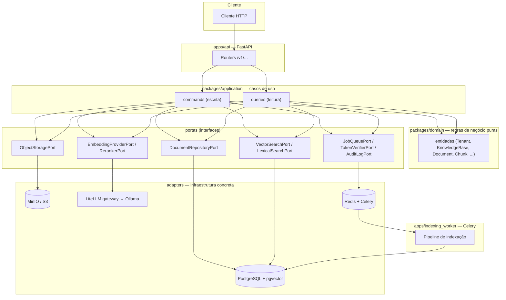

# rag-platform

Plataforma self-service de RAG (Retrieval-Augmented Generation) multi-tenant: ingestão de documentos, recuperação híbrida (vetorial + lexical), geração de respostas fundamentada em citações, avaliação de qualidade, governança e observabilidade de ponta a ponta.

[](https://www.python.org/)
[](https://fastapi.tiangolo.com/)
[](https://docs.pydantic.dev/)
[](https://www.sqlalchemy.org/)
[](https://alembic.sqlalchemy.org/)
[](https://www.postgresql.org/)
[](https://github.com/pgvector/pgvector)
[](https://redis.io/)
[](https://docs.celeryq.dev/)
[](https://min.io/)
[](https://www.litellm.ai/)
[](https://ollama.com/)
[](https://github.com/docling-project/docling)
[](https://opentelemetry.io/)
[](https://prometheus.io/)
[](https://grafana.com/)
[](https://www.docker.com/)
[](.github/workflows)
[](https://docs.astral.sh/ruff/)
[](https://mypy-lang.org/)
[](https://docs.pytest.org/)

## Visão geral

O `rag-platform` deixa qualquer time criar bases de conhecimento, enviar documentos (PDF, Markdown, TXT, DOCX) e consultá-los por linguagem natural, recebendo respostas fundamentadas — sempre com citação da evidência usada, nunca uma afirmação inventada quando não há evidência suficiente. É multi-tenant desde a base: todo dado é isolado por `tenant_id`, e um recurso de outro tenant nunca é distinguível de um recurso inexistente (404, nunca 403).

O projeto está sendo construído de forma incremental a partir de um backlog de atividades (`RAG-XXX`) descrito em [`rag-platform-llm-implementation-plan.md`](rag-platform-llm-implementation-plan.md) — o documento de referência para requisitos, arquitetura-alvo e critérios de aceite de cada atividade. Cada atividade é entregue em uma branch/PR separada, com lint, checagem de tipos, testes com cobertura, migrations e segurança (SAST/SCA/secret scanning) validados antes do merge.

As decisões de design e limitações conhecidas de cada atividade já implementada estão documentadas em [`IMPLEMENTATION.md`](IMPLEMENTATION.md) — este README foca no panorama do projeto: o que é, com quais tecnologias, a arquitetura e a estrutura de diretórios.

## Tecnologias

**API e aplicação**
- **Python 3.12** — linguagem de todo o backend (API, workers, scripts).
- **FastAPI** — API HTTP assíncrona (`/v1/...`), com `TestClient`/`app.openapi()` validados em CI.
- **Pydantic v2** — validação de contratos HTTP, configuração da aplicação (Pydantic Settings) e entidades de domínio (modelos imutáveis, `frozen=True`).
- **SQLAlchemy (async) + Alembic** — ORM e migrations versionadas contra PostgreSQL, via `asyncpg`.

**Dados e mensageria**
- **PostgreSQL 16 + pgvector** — banco relacional único, também usado para busca vetorial (índice HNSW) e busca lexical (Full Text Search nativo, índice GIN) — sem um banco vetorial separado.
- **Redis** — broker e result backend do Celery.
- **Celery** — fila e workers assíncronos (indexação de documentos, e futuramente avaliação).
- **MinIO (S3-compatible)** — armazenamento dos arquivos originais enviados, via `aioboto3`.

**IA e recuperação**
- **LiteLLM** — gateway único para embeddings, reranking e geração, por trás de aliases versionados (`config/models/`) — trocar o modelo real por trás de um alias é configuração do gateway, não do código.
- **Ollama** — serve o modelo de embeddings self-hospedado (Qwen3-Embedding-0.6B) via `llama.cpp`, sem depender de um provedor pago.
- **Docling** — extração de texto e metadados de documentos (Markdown, TXT e DOCX hoje; PDF é uma limitação temporária, ver `IMPLEMENTATION.md`).
- Fusão **RRF (Reciprocal Rank Fusion)** dos rankings vetorial + lexical, e reranking por cross-encoder configurável.

**Observabilidade e segurança**
- **OpenTelemetry** — tracing distribuído (API + worker) e métricas técnicas/de negócio, sem captura de conteúdo sensível.
- **Prometheus + Grafana** — coleta e dashboards das métricas exportadas.
- **JWT (PyJWT)** — autenticação e resolução de tenant; modo local simulado explicitamente não-produtivo.
- **gitleaks, bandit, pip-audit, hadolint** — secret scanning, SAST, SCA e lint de Dockerfile no CI, com governança de exceções (`security/exceptions.yml`).

**Qualidade e entrega**
- **Ruff, Mypy, Pytest (+ cobertura)** — lint, checagem de tipos e testes; gate mínimo de cobertura em 85%.
- **Docker + Docker Compose** — ambiente local completo (Postgres, Redis, MinIO, Ollama, LiteLLM, OTel Collector, Prometheus, Grafana) e imagens de produção da API/worker.
- **GitHub Actions** — CI em toda PR (lint, typecheck, testes, migrations, segurança) e publicação de imagens no GHCR a cada push em `master`.

## Arquitetura

Arquitetura hexagonal (portas e adaptadores): o domínio e os casos de uso (`packages/domain`, `packages/application`) não importam nenhum framework de infraestrutura — nem SQLAlchemy, nem um cliente HTTP, nem um SDK de nuvem. Toda dependência externa é uma **porta** (uma interface Python) com um ou mais **adapters** concretos, trocáveis sem tocar o domínio (por exemplo, `KnowledgeBaseRepositoryPort` tem um adapter em memória para testes e um adapter Postgres para produção).



**Fluxo de ingestão** (upload → indexação): o cliente envia um documento (`POST /v1/knowledge-bases/{id}/documents`), que é validado, armazenado no object storage e enfileirado como `IndexJob`. Um worker Celery consome o job, extrai o conteúdo (Docling), normaliza e divide em chunks determinísticos, gera embeddings em lote (LiteLLM/Ollama) e persiste tudo numa única transação que ativa a nova versão do documento — sem nunca deixar uma versão parcialmente indexada visível.

**Fluxo de consulta** (retrieval → geração, em construção): a pergunta é embedada e buscada em paralelo por similaridade vetorial e por full-text search; os dois rankings são combinados por RRF e reordenados por um reranker configurável; as evidências resultantes alimentam a construção de contexto (dentro de um orçamento de tokens) e a geração de resposta fundamentada, sempre citando a evidência usada — sem evidência suficiente, a resposta é a recusa explícita, nunca uma invenção.

**Isolamento multi-tenant**: toda consulta ao banco recebe `tenant_id` explicitamente (nunca um filtro implícito ou global); a identidade e o tenant são resolvidos a partir de um JWT verificado em cada requisição; um recurso de outro tenant é sempre 404, nunca 403 — para não vazar nem a existência do recurso.

**Erros e observabilidade**: toda resposta de erro segue [Problem Details](https://www.rfc-editor.org/rfc/rfc7807) (RFC 7807), nunca uma stack trace; toda requisição, upload, indexação e (futuramente) consulta é rastreada via OpenTelemetry e instrumentada com métricas Prometheus, sem capturar conteúdo sensível em nenhuma das duas.

## Estrutura do projeto

```text
rag-platform/
├── apps/                      # pontos de entrada dos processos
│   ├── api/                   # FastAPI: routers, dependencies, main.py
│   ├── indexing_worker/       # worker Celery de indexação
│   └── evaluation_worker/     # worker de avaliação (E6, em construção)
├── packages/                  # domínio e lógica de aplicação (sem infra)
│   ├── domain/                # entidades, enums, exceções — regras puras
│   ├── application/           # casos de uso (commands/queries) + portas
│   ├── contracts/              # schemas Pydantic dos endpoints HTTP
│   ├── config/                # Settings (Pydantic Settings) e aliases de modelo
│   ├── generation/             # prompt versionado, context builder
│   ├── retrieval/              # fusão RRF
│   ├── ingestion/               # normalização e chunking
│   ├── evaluation/             # schema do dataset dourado
│   └── observability/          # tracing e métricas (OpenTelemetry)
├── adapters/                   # implementações concretas de cada porta
│   # postgres/, object_storage/, queue/, docling/, litellm/, reranker/,
│   # vector_search/, lexical_search/, token_verifier/, audit_log/,
│   # document_repository/, document_processor/,
│   # knowledge_base_repository/, evaluation/
├── migrations/                 # Alembic (schema versionado)
├── config/                     # YAML versionado: prompts/, models/, retrieval/
├── datasets/golden/             # dataset dourado de avaliação
├── deploy/                     # compose/ e observability/ (dashboards Grafana)
├── scripts/                     # utilitários (ex.: mintar token JWT local)
├── security/                    # exceções de segurança (`exceptions.yml`)
├── tests/                       # unit/, integration/, contract/, e2e/, evaluation/
├── .github/workflows/            # CI (PR) e segurança
├── docker-compose.yml            # ambiente local completo
├── Dockerfile.api / Dockerfile.worker
├── README.md                     # este arquivo
├── IMPLEMENTATION.md              # decisões de implementação por atividade
└── rag-platform-llm-implementation-plan.md   # backlog e requisitos de referência
```

## Como rodar localmente

Pré-requisito: Python 3.12 e Docker.

```bash
cp .env.example .env        # ajuste credenciais/portas se quiser
docker compose up -d        # Postgres+pgvector, Redis, MinIO, Ollama, LiteLLM, OTel, Prometheus, Grafana
docker compose ps           # aguarde todos ficarem "healthy"

make install                # cria .venv e instala dependências de desenvolvimento
.venv/bin/alembic upgrade head   # aplica as migrations

make run-api                # sobe a API em http://localhost:8000
```

```bash
curl http://localhost:8000/health/live
curl -i http://localhost:8000/health/ready   # 200 se Postgres/Redis/MinIO OK, 503 com detalhe caso contrário
```

Comandos de qualidade (rodam sobre `apps/`, `packages/`, `adapters/`, `tests/`):

```bash
make lint       # ruff check + ruff format --check
make typecheck  # mypy
make test       # pytest com relatório de cobertura (gate mínimo: 85%,
                # elevado a partir de RAG-004, quando o primeiro código
                # de aplicação real passou a existir)
make check      # lint + typecheck + test — o pipeline local completo
```

Para mintar um token JWT de desenvolvimento (modo local simulado, ver `IMPLEMENTATION.md`):

```bash
python scripts/mint_local_dev_token.py --subject dev-user --tenant-id 11111111-1111-1111-1111-111111111111
```

## Documentação adicional

- [`IMPLEMENTATION.md`](IMPLEMENTATION.md) — decisões de design, limitações conhecidas e testes de cada atividade já implementada.
- [`rag-platform-llm-implementation-plan.md`](rag-platform-llm-implementation-plan.md) — backlog, requisitos funcionais/não funcionais e critérios de aceite de referência.

## Status

34 das 48 atividades do backlog estão mescladas em `master`; detalhes de progresso por épico em [`IMPLEMENTATION.md`](IMPLEMENTATION.md#progresso-do-backlog).
