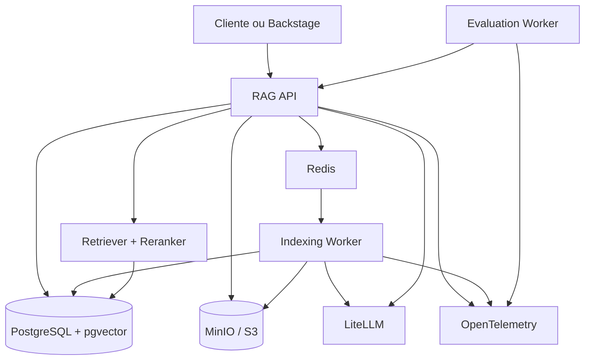
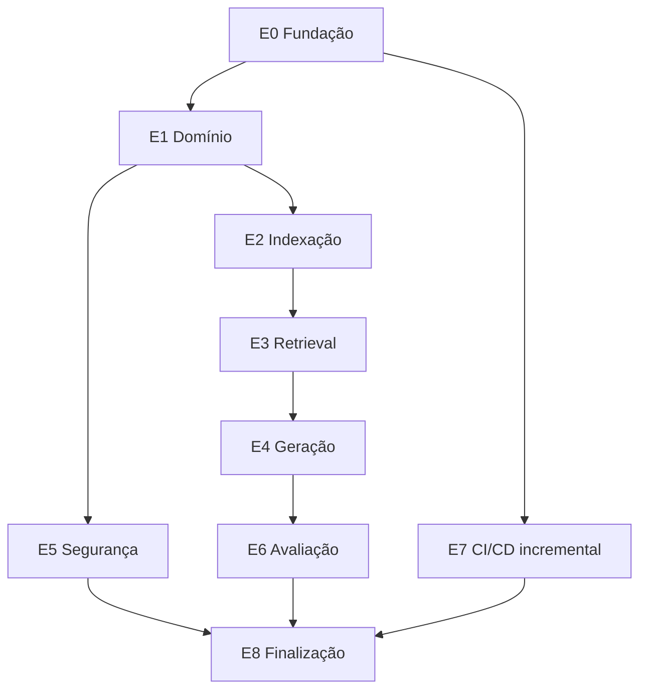

# Plano de Implementação da Plataforma RAG

> Documento orientado à execução por pessoas e modelos de linguagem.

## 1. Instruções para o agente implementador

Este documento é a fonte inicial de requisitos da POC. Antes de implementar qualquer atividade:

1. Leia este documento por completo.
2. Identifique a atividade pelo ID e confirme que todas as dependências estão concluídas.
3. Não altere decisões arquiteturais sem registrar uma ADR e solicitar validação.
4. Faça apenas uma atividade por pull request, salvo quando duas atividades forem explicitamente inseparáveis.
5. Preserve compatibilidade com os contratos públicos existentes.
6. Inclua testes automatizados para cada comportamento criado ou alterado.
7. Não use serviços externos reais nos testes de pull request.
8. Nunca versione credenciais, tokens, documentos privados ou dados pessoais.
9. Atualize documentação, exemplos e `.env.example` quando introduzir configuração.
10. Ao terminar, entregue um resumo contendo arquivos alterados, testes executados, limitações e decisões tomadas.

### Formato esperado ao decompor uma atividade

```text
Atividade: <ID e título>
Objetivo: <resultado observável>
Dependências: <IDs>
Arquivos previstos: <lista>
Passos de implementação: <lista curta>
Testes: <lista>
Critérios de aceite: <checklist>
Riscos ou dúvidas: <lista>
```

Não invente requisitos quando houver ambiguidade relevante. Registre a dúvida e interrompa apenas a parte bloqueada.

## 2. Objetivo do produto

Construir uma plataforma RAG multi-tenant capaz de:

- criar bases de conhecimento;
- receber documentos PDF, Markdown, TXT e DOCX;
- extrair, normalizar, dividir e indexar conteúdo;
- executar recuperação híbrida com filtros de autorização;
- reranquear evidências;
- gerar respostas fundamentadas via LiteLLM;
- retornar citações rastreáveis;
- medir custo, desempenho e qualidade;
- executar localmente com Docker Compose;
- utilizar GitHub Actions no CI/CD;
- evoluir posteriormente para Kubernetes e Backstage.

## 3. Resultado esperado da POC

Um usuário autorizado deve conseguir executar o seguinte fluxo:

1. Criar uma base de conhecimento.
2. Enviar um documento.
3. Receber `202 Accepted` com IDs de documento e job.
4. Consultar o status até o documento ficar `INDEXED`.
5. Fazer uma pergunta.
6. Receber resposta, citações, evidências, uso de tokens e trace ID.
7. Enviar feedback sobre a resposta.
8. Atualizar ou reindexar o documento sem indisponibilizar a versão ativa.

## 4. Escopo

### 4.1 Incluído

- API REST com OpenAPI.
- Indexação assíncrona.
- Extração de PDF, Markdown, TXT e DOCX.
- Chunking estrutural com fallback por tokens.
- Embeddings via alias no LiteLLM.
- PostgreSQL, pgvector e Full Text Search.
- MinIO como object storage local.
- Redis e Celery para filas.
- Busca híbrida e Reciprocal Rank Fusion.
- Reranker configurável.
- Geração fundamentada e resposta com citações.
- Autenticação JWT simulável localmente.
- Isolamento lógico por tenant.
- Logs estruturados, métricas e traces.
- Dataset dourado e quality gate de RAG.
- GitHub Actions e GHCR.

### 4.2 Não incluído na POC

- Fine-tuning.
- Graph RAG.
- Agentes autônomos.
- Memória de conversa persistente avançada.
- Interface web definitiva.
- Conectores para SharePoint, Confluence e bancos.
- OCR avançado.
- Provisionamento produtivo em Kubernetes.

Qualquer item fora do escopo deve ser tratado como evolução, não como requisito implícito.

## 5. Decisões arquiteturais fechadas

| Tema | Decisão |
| --- | --- |
| Linguagem | Python 3.12 |
| API | FastAPI |
| Validação | Pydantic v2 |
| ORM e migrations | SQLAlchemy 2 async + Alembic |
| Banco | PostgreSQL 16 + pgvector |
| Busca lexical | PostgreSQL Full Text Search |
| Object storage | MinIO local; interface compatível com S3 |
| Fila | Redis + Celery |
| Parsing | Docling atrás de adaptador |
| RAG framework | LlamaIndex atrás de adaptador |
| AI Gateway | LiteLLM |
| Observabilidade | OpenTelemetry, Prometheus e Grafana |
| Avaliação | Ragas ou DeepEval atrás de interface |
| Testes | Pytest, Testcontainers e mocks HTTP |
| Empacotamento | Docker |
| Desenvolvimento local | Docker Compose |
| CI/CD | GitHub Actions |
| Registry | GitHub Container Registry |

### 5.1 Regra de desacoplamento

O domínio não pode importar diretamente LlamaIndex, Docling, Celery, LiteLLM, MinIO ou pgvector. Esses componentes devem existir em `adapters/` e implementar portas definidas em `packages/application/ports/`.

## 6. Arquitetura lógica



## 7. Estrutura obrigatória do repositório

```text
rag-platform/
├── apps/
│   ├── api/
│   │   ├── main.py
│   │   ├── dependencies.py
│   │   └── routers/
│   ├── indexing_worker/
│   └── evaluation_worker/
├── packages/
│   ├── domain/
│   │   ├── entities/
│   │   ├── enums/
│   │   ├── exceptions/
│   │   └── services/
│   ├── application/
│   │   ├── commands/
│   │   ├── queries/
│   │   ├── ports/
│   │   └── use_cases/
│   ├── contracts/
│   ├── ingestion/
│   ├── retrieval/
│   ├── generation/
│   └── observability/
├── adapters/
│   ├── postgres/
│   ├── object_storage/
│   ├── queue/
│   ├── docling/
│   ├── litellm/
│   └── evaluation/
├── migrations/
├── config/
│   ├── prompts/
│   ├── retrieval/
│   └── models/
├── datasets/golden/
├── deploy/
│   ├── compose/
│   └── observability/
├── scripts/
├── tests/
│   ├── unit/
│   ├── integration/
│   ├── contract/
│   ├── e2e/
│   └── evaluation/
├── .github/workflows/
├── .env.example
├── docker-compose.yml
├── Makefile
├── pyproject.toml
└── README.md
```

## 8. Convenções de implementação

- UUID v4 para IDs públicos.
- Datas em UTC e formato ISO 8601.
- Nomes de tabela e coluna em `snake_case`.
- APIs versionadas sob `/v1`.
- Erros no formato Problem Details (`application/problem+json`).
- Logs JSON com `trace_id`, `tenant_id`, `request_id` e `job_id` quando disponíveis.
- Operações assíncronas retornam `202 Accepted`.
- Endpoints de criação devem aceitar `Idempotency-Key`.
- Paginação por cursor para listas.
- Configurações de prompt, retrieval e modelo devem possuir versão.
- Nenhuma resposta deve expor stack trace, segredo ou prompt de sistema.

## 9. Modelo de domínio mínimo

| Entidade | Campos essenciais |
| --- | --- |
| `Tenant` | id, name, status, created_at |
| `KnowledgeBase` | id, tenant_id, name, description, status, config, created_at, updated_at |
| `Document` | id, knowledge_base_id, name, mime_type, checksum, status, active_version_id, created_at |
| `DocumentVersion` | id, document_id, version, object_key, extracted_object_key, created_at |
| `Chunk` | id, tenant_id, knowledge_base_id, version_id, content, token_count, page, section, metadata, embedding |
| `IndexJob` | id, document_id, type, status, attempts, error_code, error_message, timestamps |
| `QueryLog` | id, tenant_id, knowledge_base_id, question_hash, model, latency_ms, token_usage, trace_id |
| `QueryEvidence` | query_id, chunk_id, retrieval_score, rerank_score, position |
| `Feedback` | id, query_id, rating, reason, expected_answer, created_at |
| `EvaluationRun` | id, dataset_version, config_version, metrics, status, created_at |

### 9.1 Estados do documento

```text
PENDING -> PROCESSING -> INDEXED
                      -> FAILED
                      -> QUARANTINED
INDEXED -> PROCESSING -> INDEXED
Qualquer estado permitido -> DELETED
```

Uma nova versão só se torna ativa depois que todos os chunks e embeddings forem persistidos com sucesso.

## 10. Contratos da API

### 10.1 Bases de conhecimento

```http
POST   /v1/knowledge-bases
GET    /v1/knowledge-bases
GET    /v1/knowledge-bases/{knowledge_base_id}
PATCH  /v1/knowledge-bases/{knowledge_base_id}
DELETE /v1/knowledge-bases/{knowledge_base_id}
```

### 10.2 Documentos

```http
POST   /v1/knowledge-bases/{knowledge_base_id}/documents
GET    /v1/knowledge-bases/{knowledge_base_id}/documents
GET    /v1/documents/{document_id}
POST   /v1/documents/{document_id}/reindex
DELETE /v1/documents/{document_id}
GET    /v1/jobs/{job_id}
```

### 10.3 Recuperação e geração

```http
POST /v1/knowledge-bases/{knowledge_base_id}/retrieve
POST /v1/knowledge-bases/{knowledge_base_id}/query
POST /v1/feedback
```

### 10.4 Operação

```http
GET /health/live
GET /health/ready
GET /metrics
```

### 10.5 Resposta de consulta

```json
{
  "query_id": "uuid",
  "answer": "Resposta fundamentada...",
  "grounded": true,
  "citations": [
    {
      "document_id": "uuid",
      "document_name": "guide.pdf",
      "chunk_id": "uuid",
      "page": 12,
      "section": "Publicação",
      "excerpt": "Trecho usado como evidência...",
      "score": 0.91
    }
  ],
  "model": "generation-model-alias",
  "usage": {
    "input_tokens": 900,
    "output_tokens": 140
  },
  "trace_id": "uuid"
}
```

## 11. Fluxo de indexação

1. Validar autorização, extensão, MIME type e tamanho.
2. Calcular SHA-256.
3. Detectar duplicidade no mesmo tenant e base.
4. Armazenar arquivo original.
5. Criar documento, versão e job na mesma transação lógica.
6. Publicar job na fila após persistência.
7. Worker adquire lock idempotente.
8. Extrair conteúdo e metadados.
9. Normalizar texto sem eliminar estrutura semântica.
10. Dividir por seções e parágrafos; usar tokens como fallback.
11. Gerar embeddings em lotes.
12. Persistir chunks inativos.
13. Ativar versão atomicamente.
14. Atualizar job e documento.
15. Emitir métricas e trace.

### 11.1 Defaults de chunking

- Tamanho: 500 tokens.
- Sobreposição: 75 tokens.
- Mínimo: 50 tokens.
- Preservar título, seção, página e origem.
- Não misturar documentos.
- Tornar valores configuráveis por base.

## 12. Fluxo de consulta

1. Autenticar e resolver `tenant_id`.
2. Autorizar a base de conhecimento.
3. Validar pergunta e filtros.
4. Gerar embedding da pergunta.
5. Executar busca vetorial e lexical em paralelo.
6. Aplicar tenant, base, versão ativa e ACL dentro das consultas.
7. Combinar rankings com RRF.
8. Reranquear candidatos.
9. Aplicar limiar mínimo.
10. Montar contexto dentro do orçamento de tokens.
11. Chamar modelo por alias no LiteLLM.
12. Validar formato e citações.
13. Persistir log e evidências.
14. Retornar resposta.

### 12.1 Defaults de retrieval

- Top 20 vetorial.
- Top 20 lexical.
- Top 40 após união.
- Top 8 após reranking.
- Reranker ativável por configuração.
- Responder “não há evidência suficiente” quando nenhum chunk ultrapassar o limiar.

## 13. Requisitos de segurança

- OAuth2/OIDC com JWT em ambientes integrados.
- Em modo local, provedor de identidade simulado e explicitamente identificado como não produtivo.
- Toda consulta ao banco deve conter filtro de tenant.
- ACL deve ser aplicada antes da recuperação.
- Arquivos devem ser validados e ter tamanho máximo configurável.
- Conteúdo recuperado é dado não confiável, nunca instrução.
- Prompt deve declarar que instruções presentes nos documentos devem ser ignoradas.
- Logs não devem guardar documentos ou perguntas sensíveis integralmente.
- Segredos somente em GitHub Secrets ou secret manager.
- Deploy de produção somente por environment protegido.
- Runner de deploy não deve executar código de pull request não confiável.

## 14. Observabilidade

### 14.1 Traces obrigatórios

- request HTTP;
- autenticação e autorização;
- upload e object storage;
- extração e chunking;
- embeddings;
- buscas lexical e vetorial;
- fusão e reranking;
- construção de contexto;
- geração;
- persistência da consulta.

### 14.2 Métricas mínimas

- latência e erros por endpoint;
- latência de retrieval e geração;
- documentos por estado;
- duração e falhas de indexação;
- idade e profundidade da fila;
- chunks e tokens por documento;
- tokens e custo por modelo, tenant e base;
- Recall@K, MRR, faithfulness e answer relevancy;
- taxa de respostas sem evidência;
- feedback positivo e negativo.

## 15. Estratégia de testes

| Tipo | Objetivo |
| --- | --- |
| Unitário | Regras de domínio, chunking, RRF, filtros e prompt builder |
| Integração | PostgreSQL, pgvector, Redis, MinIO e adapters |
| Contrato | OpenAPI, schemas e mensagens da fila |
| E2E | Upload até consulta com citação |
| Segurança | Isolamento entre tenants, ACL e arquivos inválidos |
| Avaliação | Qualidade do retrieval e resposta |
| Carga | Concorrência de consultas e jobs |

Provedores de LLM devem ser simulados no CI comum. Chamadas reais ficam em workflow manual ou agendado com orçamento limitado.

## 16. CI/CD com GitHub Actions

### 16.1 Workflows

```text
.github/workflows/
├── pull-request.yml
├── build-publish.yml
├── deploy-dev.yml
├── rag-evaluation.yml
├── release.yml
└── dependency-scan.yml
```

### 16.2 Pull request

1. Ruff format e lint.
2. Mypy.
3. Testes unitários.
4. Validação do OpenAPI.
5. Validação de migrations.
6. Secret scanning.
7. SAST e análise de dependências.
8. Build de validação das imagens.
9. Testes de integração.
10. Avaliação RAG reduzida quando código, prompts, retrieval ou modelos mudarem.

### 16.3 Merge na `main`

1. Repetir verificações críticas.
2. Construir imagens com BuildKit.
3. Gerar SBOM.
4. Executar scan de imagem.
5. Publicar no GHCR usando tag do SHA.
6. Implantar em DEV.
7. Executar smoke e E2E.

### 16.4 Release

1. Receber tag semântica.
2. Selecionar o digest já validado em DEV.
3. Executar avaliação completa.
4. Solicitar aprovação pelo GitHub Environment.
5. Promover o mesmo digest.
6. Executar migration compatível.
7. Fazer deploy progressivo.
8. Verificar métricas e executar rollback se necessário.

### 16.5 Regras

- Não usar `latest` em deployments.
- Não reconstruir imagem durante promoção.
- Fixar actions externas por versão confiável; preferir SHA para ações sensíveis.
- Conceder permissões mínimas ao `GITHUB_TOKEN`.
- Usar OIDC em vez de credenciais permanentes quando houver cloud.
- Dependabot deve monitorar Python, Docker e GitHub Actions.

## 17. Backlog implementável

### Épico E0 — Fundação

#### RAG-001 — Inicializar o repositório

- **Objetivo:** criar a estrutura de diretórios e configuração Python.
- **Dependências:** nenhuma.
- **Entregáveis:** `pyproject.toml`, pacotes, README, `.gitignore`, `.env.example` e Makefile.
- **Aceite:** ambiente instala; imports funcionam; `make lint` e `make test` executam.

#### RAG-002 — Padronizar qualidade de código

- **Objetivo:** configurar Ruff, Mypy, Pytest e coverage.
- **Dependências:** RAG-001.
- **Aceite:** comandos locais documentados; pipeline falha para lint ou testes inválidos; cobertura inicial publicada.

#### RAG-003 — Criar Docker Compose local

- **Objetivo:** subir PostgreSQL/pgvector, Redis, MinIO e serviços de observabilidade.
- **Dependências:** RAG-001.
- **Aceite:** `docker compose up -d` deixa dependências saudáveis; volumes e portas documentados.

#### RAG-004 — Implementar configuração da aplicação

- **Objetivo:** validar variáveis por ambiente com Pydantic Settings.
- **Dependências:** RAG-001.
- **Aceite:** startup falha com mensagem segura quando configuração obrigatória falta; segredos não aparecem em logs.

#### RAG-005 — Criar API base e health checks

- **Objetivo:** iniciar FastAPI com `/health/live` e `/health/ready`.
- **Dependências:** RAG-003, RAG-004.
- **Aceite:** liveness não depende de recursos externos; readiness valida dependências críticas.

#### RAG-006 — Configurar banco e migrations

- **Objetivo:** configurar SQLAlchemy async, Alembic e extensão vector.
- **Dependências:** RAG-003, RAG-004.
- **Aceite:** banco vazio migra até head; downgrade de desenvolvimento é testado; extensão existe.

### Épico E1 — Domínio e bases de conhecimento

#### RAG-010 — Modelar entidades e estados

- **Objetivo:** implementar entidades, enums, erros e invariantes sem dependência de infraestrutura.
- **Dependências:** RAG-001.
- **Aceite:** transições inválidas falham; testes unitários cobrem invariantes.

#### RAG-011 — Criar schema inicial

- **Objetivo:** criar tabelas e índices do modelo mínimo.
- **Dependências:** RAG-006, RAG-010.
- **Aceite:** migration cria constraints, FKs e índices; isolamento por tenant é verificável.

#### RAG-012 — Implementar CRUD de knowledge base

- **Objetivo:** criar, listar, consultar, atualizar e excluir logicamente bases.
- **Dependências:** RAG-005, RAG-011.
- **Aceite:** endpoints seguem OpenAPI; paginação funciona; tenant A não acessa tenant B.

#### RAG-013 — Implementar tratamento padronizado de erros

- **Objetivo:** retornar Problem Details com correlation ID.
- **Dependências:** RAG-005.
- **Aceite:** 400, 401, 403, 404, 409 e 422 possuem schema uniforme; stack trace não é exposto.

### Épico E2 — Ingestão e indexação

#### RAG-020 — Implementar porta de object storage

- **Objetivo:** definir interface e adapter MinIO/S3.
- **Dependências:** RAG-003, RAG-004.
- **Aceite:** upload, download e exclusão são testados; nomes são sanitizados; checksum preservado.

#### RAG-021 — Implementar upload de documentos

- **Objetivo:** validar e armazenar arquivos, criando documento, versão e job.
- **Dependências:** RAG-011, RAG-012, RAG-020.
- **Aceite:** retorna 202; detecta duplicidade; rejeita tipo/tamanho inválido; suporta idempotência.

#### RAG-022 — Implementar fila e worker

- **Objetivo:** definir porta de jobs e adapter Celery/Redis.
- **Dependências:** RAG-003, RAG-021.
- **Aceite:** job é consumido; retry exponencial funciona; falha definitiva é registrada.

#### RAG-023 — Implementar extração de conteúdo

- **Objetivo:** criar porta de parser e adapter Docling para tipos suportados.
- **Dependências:** RAG-020, RAG-022.
- **Aceite:** extrai texto e metadados; erro de parsing é categorizado; fixtures cobrem quatro formatos.

#### RAG-024 — Implementar normalização e chunking

- **Objetivo:** gerar chunks determinísticos com metadados.
- **Dependências:** RAG-023.
- **Aceite:** defaults configuráveis; não mistura documentos; preserva página/seção; testes de borda passam.

#### RAG-025 — Implementar embeddings via LiteLLM

- **Objetivo:** definir porta e adapter de embeddings em lote.
- **Dependências:** RAG-004, RAG-024.
- **Aceite:** timeout, retry e erro são tratados; alias de modelo é usado; testes não chamam serviço real.

#### RAG-026 — Persistir chunks e ativar versão

- **Objetivo:** armazenar texto, metadados e vetores e ativar versão atomicamente.
- **Dependências:** RAG-011, RAG-025.
- **Aceite:** índice parcial nunca fica ativo; reprocessamento é idempotente; versão anterior permanece consultável até a troca.

#### RAG-027 — Implementar status e reindexação

- **Objetivo:** expor status do job e permitir nova indexação.
- **Dependências:** RAG-026.
- **Aceite:** estados e erros são consultáveis; reindexação cria nova versão; consultas continuam disponíveis.

### Épico E3 — Retrieval

#### RAG-030 — Implementar busca vetorial

- **Objetivo:** recuperar chunks da versão ativa por similaridade.
- **Dependências:** RAG-026.
- **Aceite:** usa índice pgvector; aplica tenant/base/ACL na query; retorna scores.

#### RAG-031 — Implementar busca lexical

- **Objetivo:** recuperar chunks com PostgreSQL FTS.
- **Dependências:** RAG-026.
- **Aceite:** índice GIN utilizado; filtros são aplicados antes do resultado; ranking é determinístico.

#### RAG-032 — Implementar fusão RRF

- **Objetivo:** combinar rankings vetorial e lexical.
- **Dependências:** RAG-030, RAG-031.
- **Aceite:** algoritmo possui testes unitários; duplicidades são removidas; pesos são configuráveis.

#### RAG-033 — Implementar reranker

- **Objetivo:** reranquear candidatos por adapter configurável.
- **Dependências:** RAG-032.
- **Aceite:** pode ser desativado; timeout usa ranking anterior; registra latência sem registrar texto sensível.

#### RAG-034 — Criar endpoint retrieve

- **Objetivo:** expor recuperação sem geração.
- **Dependências:** RAG-033, RAG-013.
- **Aceite:** retorna evidências, metadados e scores; suporta filtros permitidos; bloqueia filtros arbitrários.

### Épico E4 — Geração fundamentada

#### RAG-040 — Versionar prompt de resposta

- **Objetivo:** criar prompt que trate contexto como dado e proíba invenção.
- **Dependências:** RAG-001.
- **Aceite:** prompt possui ID/versão; exige citações; define comportamento sem evidência.

#### RAG-041 — Implementar context builder

- **Objetivo:** selecionar evidências dentro do orçamento de tokens.
- **Dependências:** RAG-033, RAG-040.
- **Aceite:** respeita limite; preserva IDs de citação; evita duplicações excessivas.

#### RAG-042 — Implementar geração via LiteLLM

- **Objetivo:** definir porta e adapter para chat completion.
- **Dependências:** RAG-004, RAG-041.
- **Aceite:** usa alias; registra uso; aplica timeout e fallback configurável; testes usam mock.

#### RAG-043 — Validar groundedness e citações

- **Objetivo:** impedir citações inexistentes e detectar resposta sem suporte.
- **Dependências:** RAG-042.
- **Aceite:** toda citação corresponde a chunk recuperado; resposta inválida usa fallback seguro.

#### RAG-044 — Criar endpoint query

- **Objetivo:** integrar retrieval, contexto, geração e persistência.
- **Dependências:** RAG-034, RAG-043.
- **Aceite:** resposta segue contrato; inclui query ID, citações, tokens e trace ID; baixa evidência não produz afirmação inventada.

#### RAG-045 — Implementar feedback

- **Objetivo:** registrar avaliação do usuário associada à consulta.
- **Dependências:** RAG-044.
- **Aceite:** valida rating e motivo; respeita tenant; não permite feedback para query alheia.

### Épico E5 — Segurança e observabilidade

#### RAG-050 — Implementar autenticação JWT

- **Objetivo:** validar issuer, audience, assinatura e expiração.
- **Dependências:** RAG-005.
- **Aceite:** tokens inválidos são rejeitados; modo local é isolado e documentado.

#### RAG-051 — Implementar autorização e contexto do tenant

- **Objetivo:** propagar identidade e tenant de forma obrigatória.
- **Dependências:** RAG-050, RAG-012.
- **Aceite:** testes provam ausência de vazamento; repositórios exigem tenant explicitamente.

#### RAG-052 — Instrumentar OpenTelemetry

- **Objetivo:** adicionar traces e correlação em API e worker.
- **Dependências:** RAG-005, RAG-022.
- **Aceite:** fluxo upload/indexação e query possui trace; conteúdo sensível não aparece.

#### RAG-053 — Expor métricas Prometheus

- **Objetivo:** instrumentar métricas técnicas e de consumo.
- **Dependências:** RAG-052.
- **Aceite:** `/metrics` funciona; labels não possuem cardinalidade descontrolada; dashboards básicos existem.

#### RAG-054 — Implementar auditoria

- **Objetivo:** registrar ações administrativas e acesso relevante.
- **Dependências:** RAG-051.
- **Aceite:** eventos têm ator, tenant, ação, recurso e timestamp; eventos são append-only na aplicação.

### Épico E6 — Avaliação RAG

#### RAG-060 — Definir schema do dataset dourado

- **Objetivo:** versionar perguntas, respostas e evidências esperadas.
- **Dependências:** RAG-034.
- **Aceite:** schema validável; pelo menos 30 casos; inclui perguntas sem resposta.

#### RAG-061 — Implementar avaliação de retrieval

- **Objetivo:** calcular Recall@K e MRR.
- **Dependências:** RAG-060.
- **Aceite:** execução reproduzível; relatório JSON e Markdown; falha por limiar configurável.

#### RAG-062 — Implementar avaliação de geração

- **Objetivo:** medir faithfulness e answer relevancy.
- **Dependências:** RAG-044, RAG-060.
- **Aceite:** modelo avaliador configurável; custos registrados; resultados ligados às versões de prompt/modelo.

#### RAG-063 — Criar baseline da POC

- **Objetivo:** estabelecer valores iniciais e limites de regressão.
- **Dependências:** RAG-061, RAG-062.
- **Aceite:** baseline versionada; regressão máxima definida; limitações documentadas.

### Épico E7 — GitHub Actions e entrega

#### RAG-070 — Criar workflow de pull request

- **Objetivo:** automatizar qualidade, testes e build de validação.
- **Dependências:** RAG-002, RAG-003.
- **Aceite:** jobs usam cache; permissões mínimas; falha bloqueia merge; artefatos de teste são publicados.

#### RAG-071 — Adicionar segurança ao CI

- **Objetivo:** adicionar secret scanning, SAST, SCA e scan de Dockerfile.
- **Dependências:** RAG-070.
- **Aceite:** vulnerabilidade crítica bloqueia; exceções têm prazo e justificativa.

#### RAG-072 — Publicar imagens no GHCR

- **Objetivo:** construir e publicar API e workers após merge.
- **Dependências:** RAG-070, RAG-071.
- **Aceite:** tag por SHA; digest registrado; SBOM gerada; nenhuma credencial permanente necessária.

#### RAG-073 — Criar quality gate de RAG

- **Objetivo:** executar avaliação reduzida em mudanças relevantes.
- **Dependências:** RAG-063, RAG-070.
- **Aceite:** paths filters cobrem código, prompts, retrieval e modelos; relatório fica disponível no workflow.

#### RAG-074 — Automatizar deploy em DEV

- **Objetivo:** implantar digest publicado e executar smoke test.
- **Dependências:** RAG-072.
- **Aceite:** ambiente GitHub `development`; deploy rastreável; falha não promove release.

#### RAG-075 — Implementar release e produção

- **Objetivo:** promover o mesmo digest com aprovação manual.
- **Dependências:** RAG-073, RAG-074.
- **Aceite:** usa environment protegido; avaliação completa; rollback documentado e testado.

### Épico E8 — Finalização da POC

#### RAG-080 — Criar teste E2E principal

- **Objetivo:** validar base → upload → indexação → consulta → citação.
- **Dependências:** RAG-044, RAG-051.
- **Aceite:** executa automaticamente; usa fixture conhecida; valida isolamento entre dois tenants.

#### RAG-081 — Executar teste de carga

- **Objetivo:** medir latência com carga representativa.
- **Dependências:** RAG-080, RAG-053.
- **Aceite:** relatório contém cenário, volume, p50/p95/p99 e gargalos.

#### RAG-082 — Consolidar documentação operacional

- **Objetivo:** documentar execução, troubleshooting, backup e recuperação.
- **Dependências:** RAG-075, RAG-080.
- **Aceite:** uma pessoa nova consegue executar a POC apenas com o README; limitações estão explícitas.

#### RAG-083 — Validar Definition of Done

- **Objetivo:** verificar formalmente todos os critérios da POC.
- **Dependências:** RAG-081, RAG-082.
- **Aceite:** checklist aprovado; débitos remanescentes registrados; demonstração reproduzível.

## 18. Ordem recomendada



O CI deve ser criado cedo e ampliado a cada épico. Não deixar todo o Épico E7 para o fim.

## 19. Atividades paralelizáveis

Após E0:

- RAG-010 pode ocorrer em paralelo a RAG-003/RAG-004.
- RAG-020 pode ocorrer em paralelo a RAG-011.
- RAG-030 e RAG-031 podem ser implementadas em paralelo.
- RAG-040 pode ser criada antes do término de retrieval.
- RAG-050 e RAG-052 podem evoluir em paralelo ao pipeline funcional.
- RAG-060 pode começar assim que `retrieve` estiver estável.

Agentes paralelos não devem editar os mesmos arquivos centrais simultaneamente. Contratos e migrations exigem coordenação explícita.

## 20. Definition of Done da POC

- [ ] `docker compose up -d` inicia a solução.
- [ ] Base de conhecimento pode ser criada por API.
- [ ] PDF, Markdown, TXT e DOCX podem ser enviados.
- [ ] Indexação ocorre assincronamente e é observável.
- [ ] Reindexação preserva versão ativa até troca atômica.
- [ ] Busca híbrida e reranking funcionam.
- [ ] Resposta possui citações válidas.
- [ ] Ausência de evidência não gera resposta inventada.
- [ ] Dois tenants não acessam dados entre si.
- [ ] Feedback pode ser associado à consulta.
- [ ] Logs, métricas e traces permitem diagnóstico.
- [ ] Dataset dourado contém pelo menos 30 casos.
- [ ] Quality gates de código, segurança e RAG passam.
- [ ] Imagens são publicadas no GHCR por SHA.
- [ ] DEV recebe o digest validado.
- [ ] Produção exige aprovação e promove o mesmo digest.
- [ ] README permite reprodução por uma nova pessoa.

## 21. Requisitos de desempenho iniciais

Estes valores são metas da POC e devem ser medidos antes de serem tratados como SLA:

- `/retrieve` p95 menor que 1,5 segundo na carga de referência.
- `/query` p95 menor que 5 segundos, sem streaming.
- Upload retorna 202 em até 1 segundo após persistência do arquivo e do job.
- Nenhum vazamento entre tenants em 100% dos testes.
- Recall@5 inicial igual ou superior a 0,80.
- MRR inicial igual ou superior a 0,70.
- Faithfulness inicial igual ou superior a 0,85.
- Regressão máxima permitida de 5% contra a baseline aprovada.

## 22. Checklist de pull request para o agente

- [ ] A atividade e suas dependências foram identificadas.
- [ ] O escopo do PR é pequeno e coerente.
- [ ] Não há mudança arquitetural silenciosa.
- [ ] Testes unitários foram incluídos.
- [ ] Testes de integração foram incluídos quando necessários.
- [ ] OpenAPI e migrations foram atualizados quando aplicável.
- [ ] Logs não expõem dados sensíveis.
- [ ] Filtros de tenant e ACL foram verificados.
- [ ] Configurações e exemplos foram atualizados.
- [ ] Comandos de validação foram executados.
- [ ] Limitações e próximos passos foram documentados.

## 23. Formato de entrega de cada atividade

O agente deve encerrar cada atividade com:

```markdown
## Resultado
<o que foi entregue>

## Arquivos alterados
- caminho: finalidade

## Validação executada
- comando: resultado

## Decisões
- decisão e justificativa

## Limitações
- limitação conhecida

## Próxima atividade desbloqueada
- ID e título
```

## 24. Primeira iteração recomendada

Executar, nesta ordem:

1. RAG-001 — Inicializar repositório.
2. RAG-002 — Qualidade de código.
3. RAG-003 — Docker Compose.
4. RAG-004 — Configuração.
5. RAG-005 — API e health checks.
6. RAG-006 — Banco e migrations.
7. RAG-010 — Domínio.
8. RAG-011 — Schema inicial.
9. RAG-070 — Workflow inicial de pull request.

Ao concluir essa iteração, a fundação deverá estar estável para distribuir as atividades de ingestão, segurança e observabilidade.
